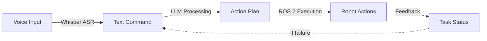
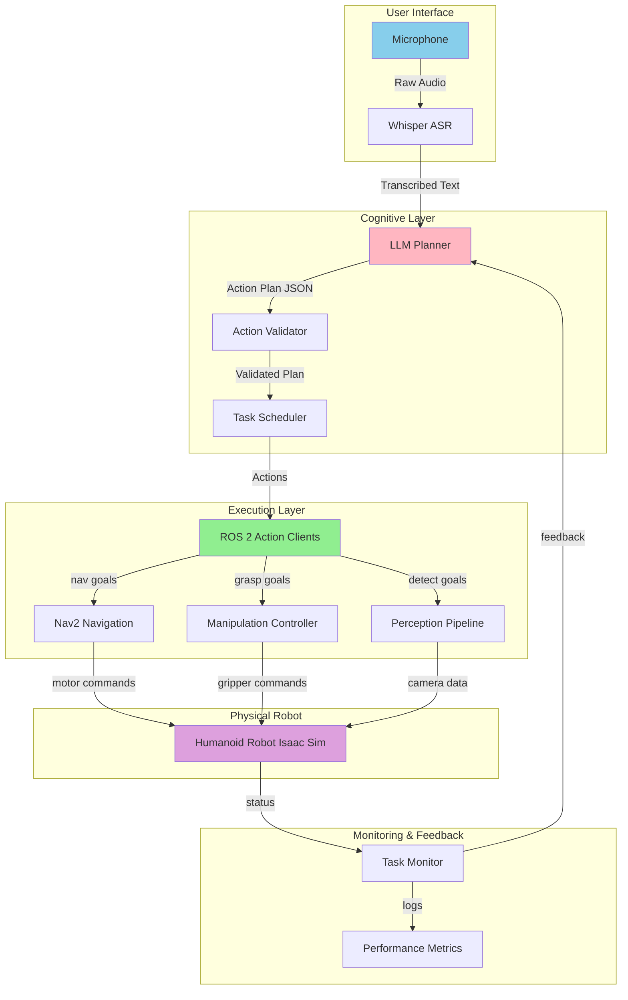

# Chapter 1: VLA Fundamentals

## 1.1 Introduction

Welcome to Module 4! In this chapter, you'll learn how **Vision-Language-Action (VLA)** convergence is transforming robotics by enabling robots to understand natural language commands and translate them into physical actions.

### Learning Objectives

By the end of this chapter, you will be able to:

1. Explain what VLA convergence means and why it matters for robotics
2. Describe the complete VLA pipeline: speech → language → action → robot
3. Understand why Large Language Models (LLMs) are useful for robotics task planning
4. Compare VLA approaches with traditional hard-coded robot behaviors
5. Identify appropriate use cases for VLA systems
6. Draw a system architecture diagram showing data flow between VLA components

### Prerequisites

Before starting this chapter, you should have:

- ✅ Completed **Module 1** (ROS 2 Basics): Understanding of nodes, topics, actions
- ✅ Completed **Module 3** (Isaac Sim & Nav2): Familiar with navigation and simulation
- ✅ Basic understanding of AI concepts (what an LLM is, speech recognition at a high level)
- ✅ Comfort with Python programming

### Estimated Time

**2-3 hours** to complete this chapter, including exercises

---

## 1.2 What is VLA Convergence?

**Vision-Language-Action (VLA)** refers to the integration of three key modalities in robotics:

1. **Vision**: Perceiving the environment through cameras and sensors
2. **Language**: Understanding and generating natural language (human commands and responses)
3. **Action**: Executing physical behaviors (navigation, manipulation, interaction)

### The Traditional Robotics Problem

Historically, robots required explicit programming for every task:

```python
# Traditional approach: Hard-coded behavior
if command == "go to kitchen":
    navigate_to(x=5.0, y=3.0)
elif command == "pick up cup":
    if detect_cup():
        grasp_object("cup")
# Need to code every possible command!
```

**Limitations**:
- Inflexible: Must anticipate every possible command
- Brittle: Small variations break the system ("go to the kitchen" vs "navigate to kitchen")
- Time-consuming: Requires extensive programming for each new task
- Not scalable: Exponential complexity as tasks increase

### The VLA Paradigm Shift

VLA systems use **Large Language Models (LLMs)** as the "brain" to interpret commands and generate action plans:

```python
# VLA approach: LLM interprets and plans
user_command = "Go to the kitchen and bring me a cup"

# LLM translates to structured plan
llm_plan = llm.generate_plan(user_command)
# Result: [navigate_to_pose(kitchen), detect_object(cup), grasp_object(), navigate_to_person()]

# Execute actions
for action in llm_plan:
    execute(action)
```

**Advantages**:
- Flexible: Handles natural language variations automatically
- Adaptive: Can reason about novel situations
- Scalable: No need to hard-code every scenario
- Human-friendly: Natural language interface

---

## 1.3 Why LLMs for Robotics?

Large Language Models bring several unique capabilities to robotics:

### 1. Natural Language Understanding

LLMs excel at parsing human commands and extracting intent:

**Example**:
- "Go to the door" → Intent: Navigation, Target: door
- "Find the red ball and bring it to me" → Intent: Search + Retrieval, Object: red ball, Recipient: user

### 2. Task Decomposition

LLMs can break complex commands into sequential sub-tasks:

**Example**: "Prepare the table for dinner"
```
LLM decomposition:
1. navigate_to(table)
2. detect_objects(table_surface)
3. clear_table() if objects present
4. fetch_items(plates, utensils)
5. place_items_on_table()
```

### 3. Contextual Reasoning

LLMs can reason about spatial relationships, object properties, and task constraints:

**Example**: "Put the cup next to the plate"
- LLM understands: "next to" = spatial proximity
- Generates: place_object(cup, relative_to=plate, offset=0.15m)

### 4. Generalization

Unlike traditional rule-based systems, LLMs can handle commands they've never seen before by leveraging learned patterns:

**Novel Command**: "Take the mug from the counter to the living room"
- No explicit programming needed
- LLM generates: navigate_to(counter) → grasp(mug) → navigate_to(living_room) → place(mug)

### 5. Error Recovery

LLMs can re-plan when actions fail:

```
Initial Plan: navigate_to(door) → open_door()
Execution: navigate_to(door) ✅ → open_door() ❌ (door locked)
LLM Re-plan: "Door is locked, searching for key" → detect_object(key) → grasp(key) → unlock_door() → open_door()
```

---

## 1.4 VLA Pipeline Architecture

The complete VLA pipeline consists of four stages:



### Stage 1: Speech Recognition (Whisper)

**Input**: Raw audio from microphone
**Process**: Automatic Speech Recognition (ASR) using OpenAI Whisper
**Output**: Transcribed text command

**Example**:
```
Audio: [user speaks] "Navigate to the kitchen"
Whisper Output: "Navigate to the kitchen"
Confidence: 0.97 (97% accurate)
```

### Stage 2: Language Understanding & Planning (LLM)

**Input**: Text command from Stage 1
**Process**: LLM interprets intent and generates structured action plan
**Output**: Sequence of ROS 2 actions with parameters

**Example**:
```json
{
  "task": "Navigate to the kitchen",
  "actions": [
    {
      "type": "navigate_to_pose",
      "parameters": {
        "target": "kitchen",
        "pose": {"x": 5.0, "y": 3.0, "orientation": 0.0}
      }
    }
  ]
}
```

### Stage 3: Action Execution (ROS 2)

**Input**: Action plan from Stage 2
**Process**: ROS 2 action clients execute each action sequentially
**Output**: Robot performs physical tasks

**Example**:
```
Action: navigate_to_pose(x=5.0, y=3.0)
Execution: Nav2 navigation stack controls motors
Result: Robot reaches kitchen (x=5.02, y=2.98) ✅
```

### Stage 4: Feedback & Monitoring

**Input**: Action results from Stage 3
**Process**: Monitor execution status, detect failures
**Output**: Success/failure reports, trigger re-planning if needed

**Example**:
```
Status: "Navigation 75% complete, 2 meters remaining"
Result: "Task completed successfully in 45 seconds"
```

---

## 1.5 VLA vs Traditional Approaches

Let's compare VLA systems with traditional robotics approaches:

| Aspect | Traditional (Hard-Coded) | VLA (LLM-Based) |
|--------|-------------------------|-----------------|
| **Command Interface** | Predefined keywords/codes | Natural language |
| **Flexibility** | Fixed behaviors only | Adapts to novel commands |
| **Development Time** | Weeks/months per task | Hours/days for new capabilities |
| **Scalability** | Linear (N commands = N implementations) | Sub-linear (LLM generalizes) |
| **Error Recovery** | Manual error handling per case | LLM can re-plan autonomously |
| **User Experience** | Technical, requires training | Intuitive, natural language |
| **Robustness** | Brittle to variations | Handles paraphrasing well |
| **Predictability** | Deterministic | Probabilistic (needs validation) |
| **Latency** | Fast (\<100ms) | Slower (1-5 seconds for LLM) |
| **Cost** | No runtime cost | API costs or local compute |

### When to Use VLA

**VLA is ideal for**:
- ✅ Human-robot collaboration scenarios (service robots, assistive robots)
- ✅ Dynamic environments where tasks vary frequently
- ✅ Prototyping and research (fast iteration)
- ✅ Complex multi-step tasks requiring reasoning
- ✅ Situations where natural language interface is valuable

**Traditional approaches are better for**:
- ❌ Safety-critical systems (determinism required)
- ❌ Real-time control (\<10ms latency requirements)
- ❌ Highly repetitive tasks with fixed procedures
- ❌ Resource-constrained systems (no compute for LLM)
- ❌ Offline operation (no internet for cloud LLMs)

---

## 1.6 Use Cases and Applications

### 1. Service Robots

**Scenario**: Restaurant service robot
```
Customer: "Bring me a glass of water, please"
VLA System: navigate_to(kitchen) → detect_object(glass) → fill_water() → navigate_to(table_5) → deliver(glass)
```

**Why VLA**: Natural customer interaction, varied requests

### 2. Assistive Robotics

**Scenario**: Home assistant for elderly care
```
User: "I dropped my pills, can you help me find them?"
VLA System: navigate_to(user_location) → search_floor(pills) → detect_object(pills) → grasp(pills) → hand_to_person()
```

**Why VLA**: Adaptive to emergent needs, natural communication

### 3. Warehouse Automation

**Scenario**: Inventory management robot
```
Operator: "Check if we have any red boxes on shelf C3"
VLA System: navigate_to(shelf_C3) → scan_shelf() → detect_objects(color=red, type=box) → report_count()
```

**Why VLA**: Flexible queries, no need to pre-program every inventory check

### 4. Research and Education

**Scenario**: Robotics lab experimentation
```
Student: "Test navigation to three random locations in the workspace"
VLA System: generate_random_poses(count=3, bounds=workspace) → for each pose: navigate_to(pose) → log_result()
```

**Why VLA**: Rapid prototyping, exploratory tasks

### 5. Household Robots

**Scenario**: Cleaning assistant
```
User: "Clean up the toys in the living room"
VLA System: navigate_to(living_room) → detect_objects(category=toys) → for each toy: grasp(toy) → navigate_to(toy_box) → place(toy)
```

**Why VLA**: Varied household tasks, natural family communication

---

## 1.7 System Architecture Diagram

Here's a complete system architecture showing how VLA components interact:



**Key Components**:

1. **Whisper ASR**: Converts speech to text
2. **LLM Planner**: Generates action sequences from natural language
3. **Action Validator**: Ensures LLM output is safe and valid
4. **Task Scheduler**: Manages execution order and dependencies
5. **ROS 2 Action Clients**: Executes actions via ROS 2
6. **Nav2 Navigation**: Handles robot movement (from Module 3)
7. **Manipulation Controller**: Controls robot arm/gripper
8. **Perception Pipeline**: Processes camera/sensor data
9. **Task Monitor**: Tracks execution status and triggers re-planning

---

## 1.8 Exercises

### Exercise 1: Explain the VLA Pipeline

**Task**: In your own words, explain each stage of the VLA pipeline for this command:

```
User says: "Go to the table and pick up the red cup"
```

Answer these questions:
1. What does Whisper do at Stage 1?
2. What actions would the LLM generate at Stage 2?
3. How would ROS 2 execute these actions at Stage 3?
4. What feedback would be generated at Stage 4?

**Estimated Time**: 15 minutes

---

### Exercise 2: Draw the System Architecture

**Task**: Draw a system architecture diagram (on paper or digital) showing:
- All 4 stages of the VLA pipeline
- Data flow between components
- Which components run where (cloud vs robot)

**Success Criteria**:
- Diagram includes Whisper, LLM, ROS 2, and Robot components
- Arrows show data flow direction
- Labels indicate what data is passed between stages

**Estimated Time**: 20 minutes

---

### Exercise 3: VLA vs Traditional Comparison

**Task**: For each scenario, decide if VLA or traditional hard-coded approach is better. Explain why.

1. **Scenario A**: Factory robot that picks the same part from a conveyor belt 10,000 times per day
2. **Scenario B**: Hotel concierge robot that answers guest questions and provides directions
3. **Scenario C**: Surgical robot performing precise incisions (life-critical)
4. **Scenario D**: Home robot that helps with various household chores

**Format**: For each scenario, write:
- Choice: VLA or Traditional
- Reasoning: 2-3 sentences explaining your decision

**Estimated Time**: 15 minutes

---

### Exercise 4: Use Case Analysis

**Task**: Design a use case for a VLA-powered robot in one of these domains:
- Education (tutoring robot)
- Healthcare (patient assistant)
- Retail (store assistant)

Include:
1. **Context**: Where is the robot deployed?
2. **Example Commands**: 3-5 natural language commands users would give
3. **LLM Action Plans**: For each command, list the actions the LLM would generate
4. **Why VLA**: Explain why VLA is a good fit for this use case

**Estimated Time**: 30 minutes

---

### Exercise 5: Error Handling

**Task**: Consider this scenario:

```
Command: "Bring me the book from the shelf"
Plan: navigate_to(shelf) → detect_object(book) → grasp(book) → navigate_to(person)
Execution: navigate_to(shelf) ✅ → detect_object(book) ❌ (book not found)
```

Questions:
1. What information should the system provide to the LLM for re-planning?
2. What are 2-3 alternative plans the LLM could generate?
3. How would the system communicate the problem to the user?

**Estimated Time**: 20 minutes

---

## 1.9 Summary & Next Steps

### Key Takeaways

In this chapter, you learned:

1. ✅ **VLA Convergence**: Integration of vision, language, and action enables natural language robot control
2. ✅ **Why LLMs**: Language models provide flexibility, task decomposition, reasoning, and generalization
3. ✅ **VLA Pipeline**: 4 stages - Speech Recognition (Whisper) → Language Planning (LLM) → Action Execution (ROS 2) → Feedback
4. ✅ **Trade-offs**: VLA offers flexibility and natural interface but trades off latency and determinism
5. ✅ **Use Cases**: Best for human-robot interaction, dynamic environments, and complex multi-step tasks

### What's Next?

In **Chapter 2: Voice-to-Action with Whisper**, you'll:
- Install and configure OpenAI Whisper for speech recognition
- Learn about Whisper model sizes and accuracy vs speed trade-offs
- Implement a ROS 2 node that publishes voice commands
- Test transcription with real voice input
- Understand multi-language support and noise handling

**Estimated Time for Chapter 2**: 3-4 hours

### Recommended Reading

For deeper understanding, explore these resources:

- Radford, A., Kim, J. W., Xu, T., Brockman, G., McLeavey, C., & Sutskever, I. (2022). Robust speech recognition via large-scale weak supervision. *arXiv preprint arXiv:2212.04356*. https://arxiv.org/abs/2212.04356

- Brown, T. B., Mann, B., Ryder, N., Subbiah, M., Kaplan, J., Dhariwal, P., ... & Amodei, D. (2020). Language models are few-shot learners. *Advances in Neural Information Processing Systems*, 33, 1877-1901.

- Macenski, S., Martín, F., White, R., & Clavero, J. G. (2020). The marathon 2: A navigation system. *2020 IEEE/RSJ International Conference on Intelligent Robots and Systems (IROS)*, 2718-2725. https://doi.org/10.1109/IROS45743.2020.9341207

---

**Tags**: vla, fundamentals, llm, robotics, natural-language, architecture

**Prev**: [Module 3 Ch6: End-to-End Capstone](../module-3-isaac/ch6-end-to-end-capstone.md)
<!-- **Next**: [Ch2: Voice-to-Action with Whisper](./ch2-voice-to-action.md) - Coming soon -->
