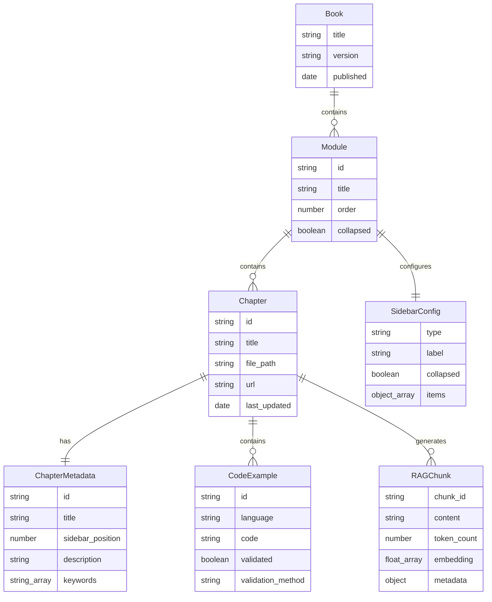

# Data Models: Docusaurus Book Architecture

**Date**: 2025-12-18
**Feature**: 001-ros2-basics
**Purpose**: Define data schemas for chapters, modules, code examples, and RAG chunks

---

## Entity 1: Module

**Description**: A high-level grouping of related chapters covering a major topic area (e.g., ROS 2, Simulation, Vision-Language-Action models).

**Fields**:
- `id` (string, required): Unique identifier (e.g., "module-1-ros2")
- `title` (string, required): Display title (e.g., "Module 1: The Robotic Nervous System")
- `description` (string, optional): Brief overview of module content
- `order` (number, required): Sort order for sidebar (1, 2, 3...)
- `chapters` (Chapter[], required): Array of chapters in this module
- `collapsed` (boolean, default: false): Whether sidebar category starts collapsed

**Relationships**:
- **Has many** Chapters
- **Belongs to** Book

**Example**:
```json
{
  "id": "module-1-ros2",
  "title": "Module 1: The Robotic Nervous System (ROS 2)",
  "description": "Learn ROS 2 middleware, nodes, topics, services, and URDF for humanoid robots",
  "order": 1,
  "collapsed": false,
  "chapters": [
    { "id": "ch1-ros2-basics", "title": "Chapter 1: ROS 2 Basics", "order": 1 },
    { "id": "ch2-rclpy-control", "title": "Chapter 2: rclpy Control", "order": 2 },
    { "id": "ch3-urdf-humanoids", "title": "Chapter 3: URDF for Humanoids", "order": 3 }
  ]
}
```

---

## Entity 2: Chapter

**Description**: A single chapter within a module, representing a markdown file with educational content.

**Fields**:
- `id` (string, required): Unique identifier (e.g., "ch1-ros2-basics")
- `title` (string, required): Full chapter title
- `sidebar_label` (string, optional): Short label for sidebar (defaults to title)
- `sidebar_position` (number, required): Order within module
- `module_id` (string, required): Parent module identifier
- `file_path` (string, required): Relative path from docs/ root (e.g., "module-1-ros2/ch1-ros2-basics.md")
- `url` (string, required): Public URL path (e.g., "/module-1-ros2/ch1-ros2-basics")
- `frontmatter` (ChapterMetadata, required): YAML frontmatter object
- `last_updated` (date, optional): ISO 8601 date of last edit
- `authors` (string[], optional): List of contributor names
- `keywords` (string[], optional): SEO keywords

**Relationships**:
- **Belongs to** Module
- **Has many** CodeExamples
- **Has many** RAGChunks

**Example**:
```json
{
  "id": "ch1-ros2-basics",
  "title": "Chapter 1: ROS 2 Basics - Nodes, Topics, Services",
  "sidebar_label": "Ch1: ROS 2 Basics",
  "sidebar_position": 1,
  "module_id": "module-1-ros2",
  "file_path": "module-1-ros2/ch1-ros2-basics.md",
  "url": "/module-1-ros2/ch1-ros2-basics",
  "frontmatter": {
    "description": "Introduction to ROS 2 architecture, nodes, topics, and services",
    "keywords": ["ROS 2", "nodes", "topics", "services", "rclpy"],
    "last_updated": "2025-12-18"
  },
  "authors": ["Physical AI Team"],
  "keywords": ["ROS 2", "pub/sub", "middleware"]
}
```

---

## Entity 3: ChapterMetadata (Frontmatter Schema)

**Description**: YAML frontmatter at the top of each markdown file, providing metadata for Docusaurus and SEO.

**Fields**:
- `id` (string, optional): Document ID (defaults to filename)
- `title` (string, required): Page title (H1)
- `sidebar_label` (string, optional): Sidebar display text
- `sidebar_position` (number, required): Order in sidebar
- `description` (string, optional): Meta description for SEO
- `keywords` (string[], optional): SEO keywords
- `authors` (object[], optional): Author metadata
- `last_updated` (date, optional): ISO 8601 date
- `tags` (string[], optional): Topic tags for categorization

**Example**:
```yaml
---
id: ch1-ros2-basics
title: "Chapter 1: ROS 2 Basics - Nodes, Topics, Services"
sidebar_label: "Ch1: ROS 2 Basics"
sidebar_position: 1
description: "Introduction to ROS 2 architecture, nodes, topics, and services for humanoid robotics"
keywords:
  - ROS 2
  - nodes
  - topics
  - services
  - rclpy
authors:
  - name: "Physical AI Team"
    url: "https://github.com/your-org"
last_updated: 2025-12-18
tags:
  - ros2
  - middleware
  - fundamentals
---
```

---

## Entity 4: CodeExample

**Description**: A code snippet embedded in a chapter, validated for syntax and tested in CI.

**Fields**:
- `id` (string, required): Unique identifier (e.g., "ch2-publisher-node-001")
- `chapter_id` (string, required): Parent chapter
- `language` (string, required): Programming language ("python", "xml", "bash", "yaml", "cpp")
- `file_path` (string, optional): Path to external file if stored in repo (e.g., "examples/talker_node.py")
- `code` (string, required): Full code content
- `title` (string, optional): Code block title (e.g., "talker.py")
- `show_line_numbers` (boolean, default: true): Display line numbers
- `validated` (boolean, required): Whether syntax validation passed
- `validation_date` (date, optional): Last validation timestamp
- `validation_method` (string, optional): Validation tool used ("ast", "ruff", "check_urdf", "shellcheck")
- `inline` (boolean, default: true): Whether code is inline or linked to external file
- `downloadable` (boolean, default: false): Whether to show download link

**Relationships**:
- **Belongs to** Chapter

**Example**:
```json
{
  "id": "ch2-publisher-node-001",
  "chapter_id": "ch2-rclpy-control",
  "language": "python",
  "file_path": "examples/talker_node.py",
  "code": "import rclpy\\nfrom std_msgs.msg import String\\n...",
  "title": "talker_node.py",
  "show_line_numbers": true,
  "validated": true,
  "validation_date": "2025-12-18T10:30:00Z",
  "validation_method": "ast + ruff",
  "inline": true,
  "downloadable": true
}
```

---

## Entity 5: RAGChunk

**Description**: A text chunk extracted from a chapter for RAG retrieval, including embedding vector and metadata.

**Fields**:
- `chunk_id` (string, required): Unique identifier (e.g., "module-1-ch1-001")
- `chapter_id` (string, required): Parent chapter
- `document_path` (string, required): Original markdown file path
- `url` (string, required): Public URL to chapter section
- `heading_h2` (string, optional): H2 heading context
- `heading_h3` (string, optional): H3 heading context
- `breadcrumb` (string, required): Navigation path (e.g., "Module 1: ROS 2 > Ch1: Basics > Nodes and Topics")
- `content` (string, required): Actual text content (markdown rendered to plain text)
- `token_count` (number, required): Approximate token count for chunking validation
- `embedding` (float[], optional): Embedding vector (1536 dimensions for text-embedding-3-small)
- `metadata` (object, required): Additional metadata for filtering
  - `module` (string): Module ID
  - `chapter` (string): Chapter ID
  - `section` (string): Section name
  - `has_code` (boolean): Whether chunk contains code blocks
  - `keywords` (string[]): Extracted keywords/tags
- `type` (string, required): Content type ("content", "content_with_code", "code_only", "table", "callout")
- `created_at` (date, required): Timestamp when chunk was created
- `updated_at` (date, required): Timestamp when chunk was last updated

**Relationships**:
- **Belongs to** Chapter

**Example**:
```json
{
  "chunk_id": "module-1-ch1-ros2-basics-001",
  "chapter_id": "ch1-ros2-basics",
  "document_path": "docs/module-1-ros2/ch1-ros2-basics.md",
  "url": "/module-1-ros2/ch1-ros2-basics#nodes-and-topics",
  "heading_h2": "Nodes and Topics",
  "heading_h3": "Publisher-Subscriber Pattern",
  "breadcrumb": "Module 1: ROS 2 > Ch1: ROS 2 Basics > Nodes and Topics",
  "content": "ROS 2 nodes are independent processes that communicate via topics. A publisher node sends messages to a topic, while subscriber nodes listen for messages on that topic. This decoupled architecture allows...",
  "token_count": 240,
  "embedding": [0.012, -0.034, 0.056, ...], // 1536 dimensions
  "metadata": {
    "module": "module-1-ros2",
    "chapter": "ch1-ros2-basics",
    "section": "Nodes and Topics",
    "has_code": false,
    "keywords": ["nodes", "topics", "pub/sub", "publisher", "subscriber"]
  },
  "type": "content",
  "created_at": "2025-12-18T10:00:00Z",
  "updated_at": "2025-12-18T10:00:00Z"
}
```

---

## Entity 6: SidebarConfig

**Description**: Configuration object for Docusaurus sidebar navigation, defining hierarchy and structure.

**Fields**:
- `type` (string, required): Item type ("category" | "doc" | "link")
- `label` (string, required): Display text in sidebar
- `items` (SidebarItem[], conditional): Child items (required for type="category")
- `collapsed` (boolean, default: true): Whether category starts collapsed
- `id` (string, conditional): Document ID (required for type="doc")
- `href` (string, conditional): External link URL (required for type="link")

**Relationships**:
- **Recursive**: SidebarConfig can contain nested SidebarConfig items

**Example** (full sidebar structure):
```javascript
// sidebars.js
module.exports = {
  mainSidebar: [
    {
      type: 'doc',
      id: 'intro',
      label: 'Introduction'
    },
    {
      type: 'category',
      label: 'Module 1: ROS 2',
      collapsed: false,
      items: [
        { type: 'doc', id: 'module-1-ros2/ch1-ros2-basics', label: 'Ch1: ROS 2 Basics' },
        { type: 'doc', id: 'module-1-ros2/ch2-rclpy-control', label: 'Ch2: rclpy Control' },
        { type: 'doc', id: 'module-1-ros2/ch3-urdf-humanoids', label: 'Ch3: URDF for Humanoids' }
      ]
    },
    {
      type: 'category',
      label: 'Module 2: Simulation',
      collapsed: true,
      items: [
        { type: 'doc', id: 'module-2-simulation/ch4-gazebo-basics', label: 'Ch4: Gazebo Basics' },
        { type: 'doc', id: 'module-2-simulation/ch5-unity-ml-agents', label: 'Ch5: Unity ML-Agents' }
      ]
    }
  ]
};
```

---

## Data Validation Rules

### Chapter Validation:
1. **Unique IDs**: All chapter IDs must be unique across the book
2. **File existence**: `file_path` must point to existing .md file
3. **Frontmatter required**: All chapters must have valid YAML frontmatter
4. **Sidebar position**: Must be sequential within module (1, 2, 3...)

### CodeExample Validation:
1. **Syntax validation**: All code must pass language-specific linter
2. **Language support**: Only supported languages ("python", "xml", "bash", "yaml", "cpp")
3. **File path**: If `inline=false`, `file_path` must exist in repo

### RAGChunk Validation:
1. **Token limit**: `token_count` must be ≤ 1000 tokens
2. **Embedding dimensions**: `embedding` must be 1536-dimensional vector (if present)
3. **URL validity**: `url` must be valid chapter URL
4. **Content non-empty**: `content` must not be empty string

### Sidebar Validation:
1. **Type consistency**: `type="doc"` requires `id`, `type="link"` requires `href`, `type="category"` requires `items`
2. **Doc ID existence**: All `id` fields must reference existing chapters
3. **No circular references**: Sidebar tree must be acyclic

---

## Schema Relationships Diagram



---

## Next Steps

1. Create JSON Schema files in `contracts/` for validation
2. Generate initial sidebar.js configuration for Module 1
3. Implement validation scripts for each entity type
4. Document usage patterns in `quickstart.md`
