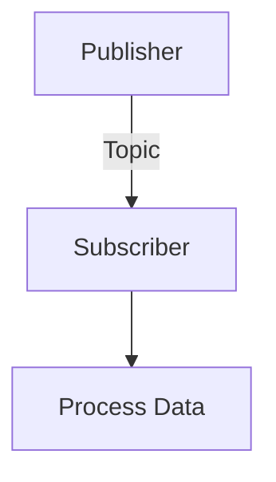

# Quickstart Guide: Contributing to Physical AI & Humanoid Robotics Textbook

**Purpose**: Step-by-step guide for content authors and developers working on the Docusaurus textbook.

---

## For Content Authors: Adding a New Chapter

### Prerequisites
- Node.js 18+ installed
- Git repository cloned
- Basic Markdown knowledge

### Step 1: Create Chapter File

1. Navigate to the appropriate module directory:
   ```bash
   cd docs/module-X-name/
   ```

2. Create a new markdown file:
   ```bash
   touch chX-chapter-name.md
   ```

3. Add YAML frontmatter at the top:
   ```markdown
   ---
   id: chX-chapter-name
   title: "Chapter X: Full Chapter Title"
   sidebar_label: "ChX: Short Title"
   sidebar_position: X
   description: "Brief description for SEO"
   keywords:
     - keyword1
     - keyword2
   last_updated: 2025-12-18
   ---

   # Chapter X: Full Chapter Title

   [Your content here...]
   ```

### Step 2: Add to Sidebar

Edit `sidebars.js` in the project root:

```javascript
module.exports = {
  mainSidebar: [
    {
      type: 'category',
      label: 'Module X: Name',
      collapsed: false,
      items: [
        { type: 'doc', id: 'module-X-name/chX-chapter-name', label: 'ChX: Title' },
        // Add your new chapter here
      ],
    },
  ],
};
```

### Step 3: Include Code Examples

**For inline code (< 20 lines)**:

````markdown
```python title="example.py" showLineNumbers
import rclpy
from std_msgs.msg import String

def main():
    rclpy.init()
    # ... your code
```
````

**For external code files**:

1. Create file in `static/code/`:
   ```bash
   mkdir -p static/code/module-X/
   cp your-example.py static/code/module-X/
   ```

2. Link in markdown:
   ```markdown
   [📥 Download example.py](/code/module-X/example.py)
   ```

### Step 4: Add Diagrams

**Using Mermaid**:

````markdown

````

**Using Images**:

1. Place image in `static/img/module-X/`:
   ```bash
   cp diagram.png static/img/module-X/
   ```

2. Reference in markdown:
   ```markdown
   
   ```

### Step 5: Test Locally

```bash
# Install dependencies (first time only)
npm install

# Start development server
npm run start

# Opens browser at http://localhost:3000
```

Navigate to your new chapter and verify:
- [ ] Chapter appears in sidebar
- [ ] All links work
- [ ] Images load correctly
- [ ] Code blocks have syntax highlighting
- [ ] Mermaid diagrams render

### Step 6: Build and Validate

```bash
# Build production site
npm run build -- --error-on-broken-links

# If build succeeds, all links are valid
```

### Step 7: Commit Changes

```bash
git add docs/module-X-name/chX-chapter-name.md sidebars.js
git commit -m "Add Chapter X: Chapter Title"
git push
```

---

## For Developers: Setting Up the Project

### Initial Setup

```bash
# Clone repository
git clone https://github.com/your-org/robotics-textbook.git
cd robotics-textbook

# Install dependencies
npm install

# Start development server
npm run start
```

### Project Structure

```
robotics-textbook/
├── docs/                  # Markdown content
│   ├── intro.md
│   ├── module-1-ros2/
│   ├── module-2-simulation/
│   └── ...
├── src/                   # React components
│   ├── components/
│   │   └── ChatbotWidget.tsx
│   ├── css/
│   └── pages/
├── static/                # Static assets
│   ├── img/
│   ├── code/
│   └── files/
├── docusaurus.config.js   # Docusaurus configuration
├── sidebars.js            # Sidebar navigation
├── package.json           # Dependencies
└── .github/workflows/     # CI/CD
```

### Available Commands

```bash
# Development
npm run start              # Start dev server (hot reload)
npm run build              # Build production site
npm run serve              # Serve built site locally

# Validation
npm run lint               # Lint markdown files
npm run validate-links     # Check for broken links
npm run validate-code      # Validate code examples

# Deployment
npm run deploy             # Deploy to GitHub Pages (manual)
```

### Adding Custom React Components

1. Create component in `src/components/`:
   ```tsx
   // src/components/MyComponent.tsx
   import React from 'react';

   export default function MyComponent() {
     return <div>Hello from custom component!</div>;
   }
   ```

2. Register globally (optional):
   ```javascript
   // src/theme/MDXComponents.js
   import React from 'react';
   import MDXComponents from '@theme-init/MDXComponents';
   import MyComponent from '@site/src/components/MyComponent';

   export default {
     ...MDXComponents,
     MyComponent,
   };
   ```

3. Use in markdown:
   ```markdown
   # My Chapter

   <MyComponent />
   ```

### Modifying Docusaurus Configuration

**Edit `docusaurus.config.js`**:

```javascript
module.exports = {
  title: 'Physical AI & Humanoid Robotics',
  tagline: 'AI-Native Textbook',
  url: 'https://your-org.github.io',
  baseUrl: '/robotics-textbook/',

  // Add new plugin
  plugins: [
    './plugins/my-custom-plugin',
  ],

  // Modify theme config
  themeConfig: {
    navbar: {
      title: 'Robotics Textbook',
      items: [
        { to: '/docs/intro', label: 'Docs', position: 'left' },
      ],
    },
  },
};
```

### Running Validation Scripts

**Validate Python Code Syntax**:
```bash
python scripts/validate_examples.py
```

**Validate URDF Files**:
```bash
python scripts/validate_urdf.py
```

**Check All Links**:
```bash
npm run build -- --error-on-broken-links
npx linkinator ./build --recurse
```

### Testing Code Examples in Docker

```bash
# Build ROS 2 test container
docker build -t robotics-textbook-test -f Dockerfile.test .

# Run tests
docker run --rm robotics-textbook-test python scripts/test_code_examples.py
```

---

## For CI/CD: Automated Workflows

### GitHub Actions Workflows

**`.github/workflows/deploy.yml`** - Deploy to GitHub Pages on push to main

**`.github/workflows/validate.yml`** - Validate links, code examples, URDF files on every PR

**`.github/workflows/test-examples.yml`** - Test code examples in Docker container

### Triggering Manual Deployment

```bash
# Via GitHub UI: Actions > Deploy to GitHub Pages > Run workflow

# Or push to main:
git push origin main
```

### Monitoring Build Status

Check GitHub Actions tab for:
- Build success/failure
- Link validation results
- Code example test results

---

## For RAG Chatbot: Setup and Integration

### Backend Setup (FastAPI)

1. Install dependencies:
   ```bash
   pip install fastapi uvicorn openai qdrant-client pydantic
   ```

2. Set environment variables:
   ```bash
   export OPENAI_API_KEY=sk-...
   export QDRANT_URL=https://your-cluster.qdrant.io
   export QDRANT_API_KEY=...
   ```

3. Run FastAPI server:
   ```bash
   uvicorn main:app --reload --port 8000
   ```

4. Test endpoint:
   ```bash
   curl -X POST http://localhost:8000/api/rag/query \
     -H "Content-Type: application/json" \
     -d '{"query": "How do I create a ROS 2 node?"}'
   ```

### Frontend Integration

**Embed chatbot widget in Docusaurus**:

1. Swizzle Layout component:
   ```bash
   npm run swizzle @docusaurus/theme-classic Layout -- --wrap
   ```

2. Edit `src/theme/Layout/index.js`:
   ```jsx
   import React from 'react';
   import Layout from '@theme-init/Layout';
   import ChatbotWidget from '@site/src/components/ChatbotWidget';

   export default function LayoutWrapper(props) {
     return (
       <>
         <Layout {...props} />
         <ChatbotWidget />
       </>
     );
   }
   ```

3. Set API URL in environment:
   ```bash
   # .env.production
   REACT_APP_RAG_API_URL=https://api.example.com
   ```

### Reindexing Embeddings

```bash
# Trigger reindex via API
curl -X POST http://localhost:8000/api/rag/reindex \
  -H "Authorization: Bearer your-jwt-token" \
  -d '{"force": true}'
```

---

## Troubleshooting

### Issue: Broken links after adding new chapter

**Solution**: Run build with link validation:
```bash
npm run build -- --error-on-broken-links
```
Check error output for specific broken links and fix.

### Issue: Code example not syntax highlighting

**Solution**: Verify language is supported in `docusaurus.config.js`:
```javascript
prism: {
  additionalLanguages: ['python', 'bash', 'xml', 'yaml'],
}
```

### Issue: Mermaid diagram not rendering

**Solution**: Ensure Mermaid is enabled:
```javascript
// docusaurus.config.js
markdown: {
  mermaid: true,
},
themes: ['@docusaurus/theme-mermaid'],
```

### Issue: Chatbot not connecting to FastAPI backend

**Solution**: Check CORS configuration in FastAPI:
```python
app.add_middleware(
    CORSMiddleware,
    allow_origins=["http://localhost:3000", "https://your-docs-site.com"],
    allow_methods=["*"],
    allow_headers=["*"],
)
```

---

## Best Practices

### Content Writing
- Use active voice
- Define technical terms on first use
- Include code examples for every concept
- Add diagrams for complex architectures
- Cite sources (ROS 2 docs, papers) in IEEE/ACM format

### Code Examples
- Keep inline examples < 20 lines
- Test all code in Docker container before committing
- Use `title` and `showLineNumbers` for readability
- Provide download links for complete examples

### File Organization
- One chapter = one .md file
- Group related images in module subdirectories
- Store reusable code in `static/code/`
- Keep URDF files in `static/models/`

### Version Control
- Commit after each chapter completion
- Use descriptive commit messages
- Create PRs for major changes
- Review build logs before merging

---

## Support

For questions or issues:
- Check [Docusaurus documentation](https://docusaurus.io/docs)
- Review [ROS 2 documentation](https://docs.ros.org/en/humble/)
- Open an issue on GitHub
- Contact the Physical AI Team

---

**Last Updated**: 2025-12-18
