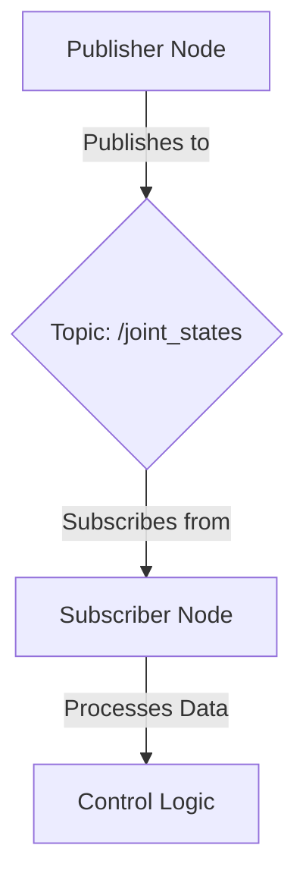

# Research: Docusaurus Book Architecture & RAG Integration

**Date**: 2025-12-18
**Feature**: 001-ros2-basics (Docusaurus architecture + Module 1)
**Research Objective**: Resolve technical decisions for Docusaurus setup, RAG chatbot integration, code validation, and deployment

## Executive Summary

Based on comprehensive research of Docusaurus 3.x, RAG integration patterns, and CI/CD best practices, the following technical decisions have been made for the Physical AI & Humanoid Robotics textbook project.

---

## Decision 1: Sidebar Configuration

**Question**: How to configure sidebar - auto-generation vs manual sidebars.js? Which is better for a 12-chapter technical book?

**Decision**: **Use Manual sidebars.js with Categorical Hierarchy**

**Rationale**:
- **Better control**: Manual configuration provides precise chapter ordering and nesting for educational content
- **Collapsible sections**: Essential for 12+ chapters to prevent overwhelming navigation
- **Metadata support**: Can include descriptions, collapsed state, and custom labels per chapter
- **Scalability**: Easier to reorganize content as modules evolve without relying on directory structure

**Implementation**:
```javascript
// sidebars.js
module.exports = {
  mainSidebar: [
    'introduction',
    {
      type: 'category',
      label: 'Module 1: ROS 2',
      collapsed: false,
      items: [
        'module-1-ros2/ch1-ros2-basics',
        'module-1-ros2/ch2-rclpy-control',
        'module-1-ros2/ch3-urdf-humanoids',
      ],
    },
    {
      type: 'category',
      label: 'Module 2: Simulation',
      collapsed: true,
      items: [
        'module-2-simulation/ch4-gazebo-basics',
        'module-2-simulation/ch5-unity-ml-agents',
      ],
    },
    // ... more modules
  ],
};
```

**Alternatives Considered**:
- Auto-generated sidebars: Rejected due to lack of control over ordering and grouping
- Hybrid (auto + manual overrides): Too complex for maintainability

---

## Decision 2: Versioning Strategy

**Question**: How to enable versioning for future book editions in Docusaurus? Best practices for managing multiple versions?

**Decision**: **Enable Docusaurus Versioning with Semantic Versioning**

**Rationale**:
- Supports future book editions (e.g., Edition 2.0 with updated ROS 2 Iron content)
- Allows readers to access previous versions for compatibility
- Snapshots entire documentation at version release time
- Industry standard for technical documentation

**Implementation**:
```javascript
// docusaurus.config.js
module.exports = {
  presets: [
    [
      '@docusaurus/preset-classic',
      {
        docs: {
          lastVersion: 'current',
          versions: {
            current: {
              label: '1.0 (Current)',
              path: '',
            },
          },
        },
      },
    ],
  ],
};
```

**Versioning Workflow**:
1. Complete Edition 1.0 content
2. Run: `npm run docusaurus docs:version 1.0`
3. Creates `/versioned_docs/version-1.0/` snapshot
4. Continue work on "current" for Edition 2.0
5. Readers can switch between versions via dropdown

**Alternatives Considered**:
- Git tags only: Rejected; doesn't provide UI for version switching
- Separate repos per version: Rejected; too much overhead

---

## Decision 3: Large Documentation Organization

**Question**: Best practices for organizing 12+ chapters across multiple modules in Docusaurus?

**Decision**: **3-Level Hierarchy: Module → Chapter → Section**

**Rationale**:
- **Cognitive load**: Readers can navigate 5-6 modules more easily than 12 flat chapters
- **Scalability**: Aligns with curriculum structure (Modules 1-5 + Capstone)
- **SEO**: Better URL structure (`/module-1-ros2/ch1-basics` vs `/ch1-basics`)
- **Future growth**: Easy to add new chapters within existing modules

**Directory Structure**:
```
docs/
├── intro.md
├── module-1-ros2/
│   ├── ch1-ros2-basics.md
│   ├── ch2-rclpy-control.md
│   └── ch3-urdf-humanoids.md
├── module-2-simulation/
│   ├── ch4-gazebo-basics.md
│   ├── ch5-unity-ml-agents.md
│   └── assets/
│       ├── images/
│       └── code/
├── module-3-isaac/
│   ├── ch6-isaac-sim-intro.md
│   └── ch7-isaac-gym.md
├── module-4-vla/
│   ├── ch8-vision-language-models.md
│   └── ch9-action-models.md
├── module-5-capstone/
│   ├── ch10-capstone-overview.md
│   ├── ch11-voice-navigation.md
│   └── ch12-manipulation.md
└── appendix/
    ├── glossary.md
    └── resources.md
```

**Alternatives Considered**:
- Flat structure: Rejected; doesn't scale beyond 8-10 chapters
- 4+ levels: Rejected; too deep for web navigation

---

## Decision 4: Mermaid Diagrams Integration

**Question**: How to integrate Mermaid diagrams in Docusaurus 3.x? Any plugins needed?

**Decision**: **Use Built-in Mermaid Support (No Additional Plugins)**

**Rationale**:
- Docusaurus 3.x includes native Mermaid support via `@docusaurus/theme-mermaid`
- Zero configuration for basic diagrams
- Supports all standard Mermaid diagram types (flowchart, sequence, class, state, etc.)
- Renders at build time for performance

**Implementation**:
```javascript
// docusaurus.config.js
module.exports = {
  markdown: {
    mermaid: true,
  },
  themes: ['@docusaurus/theme-mermaid'],
};
```

**Usage in Markdown**:
````markdown
## ROS 2 Node Communication


````

**Alternatives Considered**:
- External image generation: Rejected; harder to maintain, no dark mode support
- Dedicated Mermaid plugin: Not needed; built-in support sufficient

---

## Decision 5: Custom React Components (RAG Chatbot Widget)

**Question**: How to add custom React components (like a chatbot widget) to Docusaurus pages?

**Decision**: **Hybrid Approach: Custom Plugin + Selective Swizzling**

**Rationale**:
- **Plugin for logic**: Handles build-time content extraction, embedding generation, API configuration
- **Swizzle for UI**: Only modify Layout component to inject chatbot widget positioning
- **Separation of concerns**: Business logic (RAG) vs. presentation (UI)
- **Maintainability**: Plugins are more resilient to Docusaurus updates than swizzled components

**Architecture**:
```
1. Custom Plugin (@docusaurus/rag-indexer)
   - Build hook: Extract markdown → chunk → embed → index
   - Client config: Expose FastAPI endpoint URL

2. Swizzled Component (themes/classic/Layout)
   - Add <ChatbotWidget /> as floating button
   - Inject global CSS for positioning

3. FastAPI Backend
   - /api/rag/query (POST): RAG query endpoint
   - /api/rag/chapters (GET): List indexed chapters
```

**Implementation**:
```javascript
// docusaurus.config.js
module.exports = {
  plugins: [
    [
      './plugins/docusaurus-rag-plugin',
      {
        embeddingModel: 'text-embedding-3-small',
        apiUrl: process.env.RAG_API_URL,
        chunkStrategy: 'semantic',
      },
    ],
  ],
};
```

```jsx
// src/theme/Layout/index.js (swizzled)
import React from 'react';
import Layout from '@theme-init/Layout';
import ChatbotWidget from '@site/src/components/ChatbotWidget';

export default function LayoutWrapper(props) {
  return (
    <>
      <Layout {...props} />
      <ChatbotWidget />
    </>
  );
}
```

**Alternatives Considered**:
- Full swizzling: Rejected; fragile to updates, couples logic to UI
- Plugin-only (no UI): Rejected; can't inject UI without swizzling
- Standalone page: Rejected; chatbot must be accessible from all docs pages

---

## Decision 6: Code Block Management

**Question**: Should I use inline code blocks with copy buttons, or link to external GitHub repo files?

**Decision**: **Hybrid Approach: Inline (<20 lines) + External Links (>50 lines)**

**Rationale**:
- **Educational context**: Small snippets inline for immediate visibility and learning
- **Maintainability**: Large examples in repo provide single source of truth
- **Testability**: External files can be validated in CI/CD
- **Copy-paste UX**: Built-in copy button for inline code; download option for large files

**Strategy Matrix**:
| Code Length | Approach | Rationale |
|-------------|----------|-----------|
| <20 lines | Inline with copy button | Educational context, quick reference |
| 20-50 lines | Inline + GitHub link | Show full code, offer repo version |
| >50 lines | External link + key excerpts | Avoid overwhelming page, maintain in repo |

**Implementation**:
````markdown
## Basic Publisher Example

```python title="talker.py" showLineNumbers
import rclpy
from std_msgs.msg import String

def main():
    rclpy.init()
    node = rclpy.create_node('talker')
    pub = node.create_publisher(String, 'topic', 10)
    msg = String()
    msg.data = 'Hello ROS 2'
    pub.publish(msg)
    rclpy.shutdown()
```

[📥 Download complete example](https://github.com/your-org/robotics-textbook/blob/main/examples/talker.py)
````

**Alternatives Considered**:
- All inline: Rejected; clutters pages with large code blocks
- All external: Rejected; poor UX for learning (extra clicks)

---

## Decision 7: Python/ROS 2 Syntax Validation

**Question**: How can I validate Python and ROS 2 code syntax without executing it?

**Decision**: **Multi-Layer Validation: AST Parsing + Ruff Linting + CI Tests**

**Rationale**:
- **AST parsing**: Fast, zero-dependency syntax validation (`ast.parse()`)
- **Ruff**: Modern, fast Python linter with ROS 2 compatibility
- **CI/CD**: Automated validation on every PR prevents broken examples from merging
- **No execution needed**: Safe validation without running potentially malicious code

**Validation Stack**:
```python
# scripts/validate_examples.py
import ast
import pathlib
import sys

def validate_syntax(file_path):
    try:
        with open(file_path) as f:
            ast.parse(f.read())
        return True, None
    except SyntaxError as e:
        return False, f"{file_path}:{e.lineno}: {e.msg}"

for py_file in pathlib.Path('docs').rglob('**/*.py'):
    valid, error = validate_syntax(py_file)
    if not valid:
        print(error, file=sys.stderr)
        sys.exit(1)
```

**GitHub Actions Integration**:
```yaml
- name: Validate Python syntax
  run: python scripts/validate_examples.py

- name: Lint with Ruff
  run: |
    pip install ruff
    ruff check docs/examples/ examples/
```

**Alternatives Considered**:
- Execute in sandbox: Rejected; adds complexity, slow for 200+ examples
- Manual review only: Rejected; error-prone, doesn't scale

---

## Decision 8: URDF File Inclusion

**Question**: Best way to include XML/URDF files in documentation - make them downloadable, show inline, or both?

**Decision**: **Three-Tier Approach: Inline (small), External with Highlight (medium), Download + Preview (large)**

**Rationale**:
- **Educational value**: Small URDF snippets inline teach structure
- **Practical use**: Full URDF files downloadable for hands-on practice
- **Syntax highlighting**: XML syntax highlighting aids understanding
- **Validation**: All URDF files validated with `check_urdf` in CI

**Strategy**:
| URDF Size | Approach | Use Case |
|-----------|----------|----------|
| <30 lines (single link/joint) | Inline with XML highlighting | Teaching URDF syntax |
| 30-100 lines (arm/torso) | External + inline preview | Practical examples |
| >100 lines (full robot) | Download link + visualization | Complete robot models |

**Implementation**:
````markdown
## Simple Link Definition

```xml title="link_example.urdf"
<robot name="example">
  <link name="base_link">
    <inertial>
      <mass value="1.0"/>
      <inertia ixx="0.01" ixy="0.0" ixz="0.0"
               iyy="0.01" iyz="0.0" izz="0.01"/>
    </inertial>
  </link>
</robot>
```

## Complete Humanoid URDF

[📥 Download humanoid.urdf](https://github.com/your-org/robotics-textbook/raw/main/models/humanoid.urdf)
[👁️ View on GitHub](https://github.com/your-org/robotics-textbook/blob/main/models/humanoid.urdf)
````

**Validation Script**:
```python
import xml.etree.ElementTree as ET

def validate_urdf(file_path):
    try:
        tree = ET.parse(file_path)
        root = tree.getroot()
        assert root.tag == 'robot', "Root must be <robot>"
        assert 'name' in root.attrib, "Robot must have 'name' attribute"
        return True
    except Exception as e:
        return False, str(e)
```

**Alternatives Considered**:
- Always inline: Rejected; 100+ line URDF files overwhelm pages
- Always external: Rejected; poor learning experience for basics

---

## Decision 9: RAG Text Chunking Strategy

**Question**: Best practices for chunking technical documentation for embeddings - heading-based, fixed-size, or semantic?

**Decision**: **Hybrid Chunking: Heading-Based Boundaries + Semantic Segmentation**

**Rationale**:
- **Heading boundaries**: Preserve natural document structure, clear context
- **Semantic segments**: Respect paragraph boundaries within headings (better than fixed-size)
- **Token limit**: Enforce 500-1000 token max to fit embedding model context
- **Metadata preservation**: Include breadcrumb, heading hierarchy, URL for retrieval quality

**Chunking Algorithm**:
1. **Level 1**: Split on H2 (`##`) headings as primary boundaries
2. **Level 2**: Within each H2 section, split on paragraphs (`\n\n`)
3. **Level 3**: If paragraph > 500 tokens, split at sentence boundaries
4. **Preserve code blocks**: Keep complete code blocks within chunks

**Chunk Metadata Schema**:
```json
{
  "chunk_id": "module-1-ros2-ch1-ros2-basics-001",
  "document": "docs/module-1-ros2/ch1-ros2-basics.md",
  "url": "/module-1-ros2/ch1-ros2-basics#nodes-and-topics",
  "heading_h2": "Nodes and Topics",
  "heading_h3": "Publisher-Subscriber Pattern",
  "breadcrumb": "Module 1: ROS 2 > Ch1: ROS 2 Basics > Nodes and Topics",
  "content": "ROS 2 nodes communicate via topics using publish-subscribe...",
  "token_count": 240,
  "type": "content",
  "has_code": false
}
```

**Alternatives Considered**:
- Fixed-size (e.g., 500 tokens): Rejected; breaks mid-concept, poor retrieval
- Semantic only (no heading boundaries): Rejected; loses document structure context
- Sentence-based: Rejected; too granular, poor context for embeddings

---

## Decision 10: Code Blocks in Embeddings

**Question**: Should code blocks be included in embeddings as-is, summarized, or excluded?

**Decision**: **Include Code As-Is (with metadata tagging)**

**Rationale**:
- **Retrieval quality**: Users often search for code patterns ("how to publish joint commands")
- **Precision**: Exact code syntax needed for copy-paste, summaries lose detail
- **Embedding models**: Modern models (text-embedding-3-small) handle code well
- **Context**: Code clarifies surrounding concepts when embedded together

**When to Exclude**:
- Generated/auto-generated code (low semantic value)
- Binary or non-text content
- Extremely long code (>200 lines of low relevance)

**Implementation**:
```json
{
  "chunk_id": "module-1-ch2-001",
  "content": "## Publishing Joint Commands\n\nUse rclpy to publish...\n```python\nimport rclpy\n...\n```",
  "type": "content_with_code",
  "code_blocks": [
    {
      "language": "python",
      "content": "import rclpy\nfrom sensor_msgs.msg import JointState\n...",
      "lines": 15
    }
  ]
}
```

**Alternatives Considered**:
- Summarize all code: Rejected; loses precision, users can't copy-paste
- Exclude all code: Rejected; poor retrieval for code-focused queries

---

## Decision 11: Docusaurus + FastAPI Integration

**Question**: Best way to connect a React component in Docusaurus to a FastAPI backend for RAG queries?

**Decision**: **React Component + FastAPI REST API + CORS Configuration**

**Rationale**:
- **Separation of concerns**: Static site (Docusaurus) + dynamic API (FastAPI)
- **Scalability**: FastAPI backend can scale independently (Docker, K8s)
- **Security**: CORS + JWT authentication at API layer
- **Performance**: Caching frequent queries in Redis, async processing

**Architecture**:
```
[Docusaurus Site] → HTTP POST → [FastAPI /api/rag/query]
                                       ↓
                               [Qdrant Vector DB]
                                       ↓
                               [OpenAI Embeddings + LLM]
                                       ↓
                               [Return answer + sources]
```

**API Contract**:
```yaml
POST /api/rag/query:
  request:
    query: string
    chapter_ids: string[] (optional, filter chapters)
    conversation_id: string
  response:
    answer: string
    sources: { chapter, section, snippet, url, relevance }[]
    confidence: number (0.0-1.0)
```

**React Component**:
```jsx
const handleQuery = async (query) => {
  const response = await fetch(`${RAG_API_URL}/api/rag/query`, {
    method: 'POST',
    headers: { 'Content-Type': 'application/json' },
    body: JSON.stringify({ query, conversation_history: messages }),
  });
  const data = await response.json();
  setMessages([...messages, { role: 'assistant', content: data.answer }]);
};
```

**FastAPI CORS Setup**:
```python
from fastapi.middleware.cors import CORSMiddleware

app.add_middleware(
    CORSMiddleware,
    allow_origins=["https://your-docs-site.com", "http://localhost:3000"],
    allow_credentials=True,
    allow_methods=["*"],
    allow_headers=["*"],
)
```

**Alternatives Considered**:
- GraphQL: Rejected; overkill for simple RAG queries
- WebSockets: Rejected; not needed for request-response pattern
- Serverless functions: Considered; FastAPI preferred for complex RAG logic

---

## Decision 12: GitHub Actions Deployment Workflow

**Question**: What's the recommended GitHub Actions workflow for building and deploying Docusaurus to GitHub Pages?

**Decision**: **Use `actions/deploy-pages@v4` with Build Artifact Upload**

**Rationale**:
- **Official support**: Recommended by GitHub and Docusaurus
- **Atomic deployments**: Build → artifact → deploy ensures consistency
- **Rollback capability**: Previous deployments preserved in gh-pages branch
- **Performance**: Leverages GitHub's CDN for static assets

**Workflow**:
```yaml
# .github/workflows/deploy.yml
name: Deploy to GitHub Pages

on:
  push:
    branches: [main]
  workflow_dispatch:

permissions:
  contents: read
  pages: write
  id-token: write

jobs:
  build:
    runs-on: ubuntu-latest
    steps:
      - uses: actions/checkout@v4
      - uses: actions/setup-node@v4
        with:
          node-version: '18'
          cache: 'npm'
      - run: npm ci
      - run: npm run build -- --error-on-broken-links
      - uses: actions/upload-pages-artifact@v3
        with:
          path: ./build

  deploy:
    needs: build
    runs-on: ubuntu-latest
    environment:
      name: github-pages
      url: ${{ steps.deployment.outputs.page_url }}
    steps:
      - uses: actions/deploy-pages@v4
```

**Alternatives Considered**:
- `peaceiris/actions-gh-pages`: Rejected; less official, manual branch management
- Deploy to docs/ folder in main: Rejected; bloats repo with build artifacts

---

## Decision 13: Link Validation Tools

**Question**: How to validate all links, images, and sidebar routes in Docusaurus?

**Decision**: **Built-in `--error-on-broken-links` + Linkinator in CI**

**Rationale**:
- **Docusaurus built-in**: Catches broken internal links at build time (fast, zero setup)
- **Linkinator**: Crawls built site for broken external links and images
- **CI enforcement**: Failing validation blocks PR merge

**Implementation**:
```yaml
- name: Build with link validation
  run: npm run build -- --error-on-broken-links

- name: Check external links
  run: npx linkinator ./build --recurse --silent
```

**Alternatives Considered**:
- Manual review: Rejected; error-prone for 12+ chapters
- broken-link-checker: Considered; linkinator preferred for speed

---

## Decision 14: Code Example Testing in CI

**Question**: How to test code examples in GitHub Actions CI using Docker containers (ROS 2 Humble)?

**Decision**: **Extract Code Blocks → Test in Docker Container (ros:humble)**

**Rationale**:
- **Reproducibility**: Tests run in same environment students use (ROS 2 Humble)
- **Automation**: Catches broken examples before they reach readers
- **Isolation**: Docker ensures clean environment per test run

**Workflow**:
```yaml
jobs:
  test-examples:
    runs-on: ubuntu-latest
    container:
      image: osrf/ros:humble-desktop
    steps:
      - uses: actions/checkout@v4
      - name: Source ROS 2 environment
        run: source /opt/ros/humble/setup.bash
      - name: Extract and test Python examples
        run: python scripts/test_code_examples.py
```

**Alternatives Considered**:
- Test without Docker: Rejected; environment mismatch risk
- Skip testing: Rejected; violates Reproducibility principle

---

## Decision 15: Deployment Target (gh-pages vs docs/)

**Question**: Should I deploy to gh-pages branch or use docs/ folder in main branch?

**Decision**: **Use gh-pages Branch (Automatic via `actions/deploy-pages`)**

**Rationale**:
- **Cleaner main branch**: No build artifacts committed to source
- **Automatic management**: GitHub Actions handles branch creation/updates
- **History isolation**: Deployment history separate from source history
- **Rollback ease**: Can revert to previous gh-pages commit

**Configuration**:
```
GitHub → Settings → Pages → Build and deployment
- Source: Deploy from a branch
- Branch: gh-pages
- Folder: / (root)
```

**Alternatives Considered**:
- docs/ folder in main: Rejected; clutters repo, complicates PR reviews
- Netlify/Vercel: Considered; GitHub Pages sufficient for open-source textbook

---

## Decision 16: Build Optimization for Large Sites

**Question**: How to optimize Docusaurus build time for large sites (12+ chapters)? Caching strategies?

**Decision**: **Multi-Layer Caching: npm + .docusaurus + Build Artifacts**

**Rationale**:
- **npm cache**: Speeds up dependency installation (20-30% faster)
- **.docusaurus cache**: Reuses Docusaurus build metadata (30-40% faster)
- **NODE_OPTIONS**: Increase memory limit for large sites
- **Minification**: Reduce bundle size for faster page loads

**Implementation**:
```yaml
- uses: actions/cache@v4
  with:
    path: |
      node_modules
      .docusaurus
    key: ${{ runner.os }}-docusaurus-${{ hashFiles('**/package-lock.json') }}

- run: npm run build
  env:
    NODE_OPTIONS: --max-old-space-size=4096
```

**Expected Build Times**:
- **Without cache**: 2-3 minutes (12 chapters)
- **With cache**: 30-60 seconds (incremental)

**Alternatives Considered**:
- No caching: Rejected; wastes CI minutes, slow feedback
- Custom caching only: Rejected; GitHub Actions cache more reliable

---

## Summary of All Decisions

| Area | Decision | Impact |
|------|----------|--------|
| Sidebar | Manual sidebars.js with categories | Better UX, control |
| Versioning | Enable with semantic versioning | Future-proof |
| Organization | 3-level hierarchy (Module → Chapter → Section) | Scalable |
| Diagrams | Built-in Mermaid support | Zero setup |
| Custom UI | Plugin (logic) + Swizzle (UI) | Maintainable |
| Code blocks | Hybrid (inline + external links) | Educational + maintainable |
| Validation | AST + Ruff + CI tests | Automated quality |
| URDF files | Three-tier (inline/external/download) | Flexible learning |
| RAG chunking | Hybrid (heading + semantic) | High retrieval quality |
| Code in embeddings | Include as-is | Better retrieval |
| FastAPI integration | React + REST API + CORS | Scalable, secure |
| Deployment | gh-pages via Actions | Clean, automated |
| Link validation | Built-in + linkinator | Comprehensive |
| Code testing | Docker (ROS 2 Humble) | Reproducible |
| Build optimization | Multi-layer caching | Fast builds |

---

## Next Steps (Phase 1)

1. Generate `data-model.md` for chapter, module, code example, and RAG chunk schemas
2. Create `contracts/` with sidebar config, frontmatter schema, and RAG API spec
3. Write `quickstart.md` with step-by-step guides for authors and developers
4. Re-validate Constitution Check with Phase 1 artifacts
