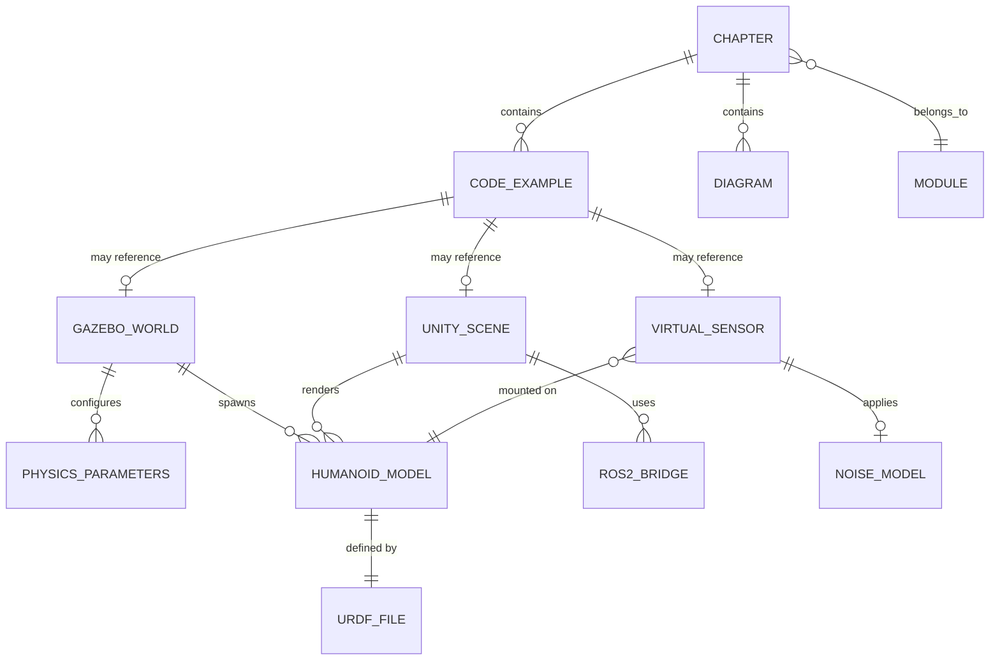

# Data Model: Module 2 - Digital Twin (Gazebo & Unity)

**Feature**: 002-digital-twin
**Date**: 2025-12-18
**Purpose**: Define key entities and their relationships for Module 2 educational content

## Overview

This document defines the logical entities (data structures, configuration objects, simulation artifacts) used throughout Module 2. These are NOT database entities or application data structures - they represent the educational content artifacts that students will create and interact with.

---

## Entity Relationship Diagram



---

## Core Entities

### 1. Chapter

**Purpose**: Organizational unit of educational content within Module 2

**Attributes**:
- `chapter_id`: string (e.g., "ch1-gazebo-physics", "ch2-unity-rendering", "ch3-sensor-simulation")
- `title`: string (e.g., "Chapter 1: Physics Simulation in Gazebo")
- `learning_objectives`: string[] (list of learning goals)
- `prerequisites`: string[] (required prior knowledge from Module 1)
- `estimated_time`: integer (minutes to complete)
- `difficulty_level`: enum ("beginner", "intermediate", "advanced")

**Relationships**:
- Belongs to Module 2
- Contains multiple Code Examples
- Contains multiple Diagrams (Mermaid, images)

**Validation Rules**:
- Must have at least 3 learning objectives
- Must reference Module 1 prerequisites
- Must include success criteria aligned with FR-015 (constitution compliance)

**Example**:
```yaml
chapter_id: ch1-gazebo-physics
title: "Chapter 1: Physics Simulation in Gazebo"
learning_objectives:
  - "Configure gravity and physics parameters in SDF world files"
  - "Understand solver iterations and timestep tradeoffs"
  - "Debug common Gazebo simulation errors"
prerequisites:
  - "Module 1: ROS 2 Basics"
  - "Understanding of URDF format"
  - "Basic Linux terminal skills"
estimated_time: 90
difficulty_level: intermediate
```

---

### 2. Code Example

**Purpose**: Runnable code snippet or complete file demonstrating a concept

**Attributes**:
- `example_id`: string (e.g., "gazebo-empty-world", "unity-ros2-bridge")
- `type`: enum ("inline", "external_file", "repository_link")
- `language`: enum ("sdf", "python", "csharp", "bash", "yaml")
- `file_path`: string (relative path for external files, e.g., "assets/code/worlds/physics_demo.sdf")
- `line_count`: integer
- `validation_status`: enum ("pending", "validated", "failed")
- `test_command`: string (optional, command to execute/test the example)
- `expected_output`: string (optional, for executable examples)

**Relationships**:
- Belongs to a Chapter
- May reference Gazebo World, Unity Scene, or Virtual Sensor configurations

**Validation Rules**:
- All Python code must pass `validate_examples.py`
- All SDF files must pass `validate_urdf.py` (XML validation)
- External files must exist in `docs/module-2-digital-twin/assets/code/`
- Inline examples must be <20 lines for readability

**Example**:
```yaml
example_id: gazebo-basic-physics
type: external_file
language: sdf
file_path: "assets/code/worlds/basic_physics.sdf"
line_count: 45
validation_status: validated
test_command: "gz sim basic_physics.sdf --iterations 100"
expected_output: "Simulation completed without errors"
```

---

### 3. Gazebo World

**Purpose**: SDF configuration file defining simulation environment, physics, and models

**Attributes**:
- `world_name`: string (e.g., "empty_world", "physics_demo", "sensor_playground")
- `sdf_version`: string (e.g., "1.8", "1.9")
- `file_path`: string (e.g., "assets/code/worlds/physics_demo.sdf")
- `physics_engine`: enum ("ode", "bullet", "dart")
- `includes_models`: string[] (list of included model URIs)
- `includes_plugins`: string[] (list of Gazebo plugins)
- `educational_purpose`: string (what concept this world teaches)

**Relationships**:
- Configures Physics Parameters
- Spawns Humanoid Models
- Referenced by Code Examples

**Validation Rules**:
- Must be valid SDF XML (schema validation)
- Must include at least one `<physics>` element
- World name must match filename (without extension)
- All model URIs must resolve (either in GAZEBO_MODEL_PATH or inline)

**Example**:
```yaml
world_name: physics_demo
sdf_version: "1.8"
file_path: "assets/code/worlds/physics_demo.sdf"
physics_engine: ode
includes_models:
  - "model://sun"
  - "model://ground_plane"
  - "model://simple_robot"
includes_plugins:
  - "gz::sim::systems::Physics"
  - "gz::sim::systems::UserCommands"
educational_purpose: "Demonstrates impact of gravity, friction, and solver iterations on simulation stability"
```

---

### 4. Physics Parameters

**Purpose**: Configurable simulation physics settings in Gazebo

**Attributes**:
- `max_step_size`: float (seconds, e.g., 0.001)
- `real_time_factor`: float (e.g., 1.0 for real-time)
- `real_time_update_rate`: float (Hz, e.g., 1000)
- `gravity_vector`: float[3] (m/s², e.g., [0, 0, -9.81])
- `solver_type`: enum ("quick", "world")
- `solver_iterations`: integer (e.g., 50)
- `cfm`: float (Constraint Force Mixing, e.g., 0.0)
- `erp`: float (Error Reduction Parameter, e.g., 0.2)

**Relationships**:
- Configured within Gazebo World
- Affects all models in simulation

**Validation Rules**:
- `max_step_size` must be > 0 and <= 0.1
- `real_time_update_rate` should equal 1/max_step_size
- `solver_iterations` must be >= 20 for stability
- Gravity magnitude should be realistic (0 to 15 m/s² range)

**Example**:
```yaml
max_step_size: 0.001
real_time_factor: 1.0
real_time_update_rate: 1000.0
gravity_vector: [0, 0, -9.81]
solver_type: quick
solver_iterations: 50
cfm: 0.0
erp: 0.2
```

---

### 5. Unity Scene

**Purpose**: Unity 3D environment for robot visualization and human-robot interaction

**Attributes**:
- `scene_name`: string (e.g., "HomeEnvironment", "FactoryFloor")
- `unity_version`: string (e.g., "2022.3.10f1")
- `ros2_bridge_configured`: boolean
- `robot_models`: string[] (list of robot GameObjects)
- `lighting_setup`: string (e.g., "Directional + HDRI skybox")
- `camera_count`: integer
- `educational_purpose`: string

**Relationships**:
- Renders Humanoid Models
- Uses ROS 2 Bridge for communication
- Referenced by Code Examples (Unity project structure)

**Validation Rules**:
- Must open without errors in specified Unity version
- ROS 2 bridge connection must be functional (TCP endpoint reachable)
- All robot models must have Articulation Body components
- Scene size must be <500MB for download feasibility

**Example**:
```yaml
scene_name: OfficeEnvironment
unity_version: "2022.3.10f1"
ros2_bridge_configured: true
robot_models:
  - "HumanoidRobot_01"
  - "ServiceRobot_02"
lighting_setup: "Directional light + area lights for desks"
camera_count: 3
educational_purpose: "Demonstrates robot navigation in indoor office setting with furniture obstacles"
```

---

### 6. ROS 2 Bridge

**Purpose**: Communication layer between Unity and ROS 2 (or Gazebo and ROS 2)

**Attributes**:
- `bridge_type`: enum ("ros_tcp_connector", "ros_gz_bridge", "parameter_bridge")
- `endpoint_ip`: string (e.g., "127.0.0.1")
- `endpoint_port`: integer (e.g., 10000)
- `topic_mappings`: map<string, string> (Gazebo/Unity topic → ROS 2 topic)
- `message_types`: string[] (e.g., ["sensor_msgs/Image", "geometry_msgs/Twist"])

**Relationships**:
- Used by Unity Scenes
- Used by Gazebo Worlds (via ros_gz_bridge)
- Bridges Virtual Sensor data to ROS 2 topics

**Validation Rules**:
- Port must be in range 1024-65535
- All topic mappings must use valid ROS 2 topic names (start with /)
- Message types must be standard ROS 2 messages or custom messages with definitions

**Example**:
```yaml
bridge_type: ros_tcp_connector
endpoint_ip: "127.0.0.1"
endpoint_port: 10000
topic_mappings:
  "/UnityCamera/image_raw": "/robot/camera/image_raw"
  "/UnityJointStates": "/robot/joint_states"
message_types:
  - "sensor_msgs/Image"
  - "sensor_msgs/JointState"
  - "geometry_msgs/Twist"
```

---

### 7. Virtual Sensor

**Purpose**: Simulated sensor (LiDAR, depth camera, IMU) providing synthetic data

**Attributes**:
- `sensor_name`: string (e.g., "front_lidar", "head_camera", "torso_imu")
- `sensor_type`: enum ("lidar", "depth_camera", "rgb_camera", "imu", "force_torque")
- `platform`: enum ("gazebo", "unity")
- `plugin_name`: string (e.g., "gazebo_ros_ray_sensor", "PerceptionCamera")
- `update_rate`: float (Hz)
- `ros2_topic`: string
- `message_type`: string (e.g., "sensor_msgs/LaserScan")
- `range_min`: float (meters, for range sensors)
- `range_max`: float (meters)
- `resolution`: float or int[2] (depends on sensor type)

**Relationships**:
- Mounted on Humanoid Model
- Applies Noise Model
- Publishes to ROS 2 topics via Bridge

**Validation Rules**:
- `update_rate` must be <= simulation update rate
- `range_max` must be > `range_min`
- ROS 2 topic must match standard naming conventions
- Message type must be compatible with sensor type

**Example (LiDAR)**:
```yaml
sensor_name: front_lidar
sensor_type: lidar
platform: gazebo
plugin_name: gazebo_ros_ray_sensor
update_rate: 10.0
ros2_topic: /robot/scan
message_type: sensor_msgs/LaserScan
range_min: 0.12
range_max: 10.0
resolution: 360  # samples per scan
```

**Example (Depth Camera)**:
```yaml
sensor_name: head_depth_camera
sensor_type: depth_camera
platform: unity
plugin_name: PerceptionCamera
update_rate: 30.0
ros2_topic: /robot/camera/depth/image_raw
message_type: sensor_msgs/Image
range_min: 0.3
range_max: 10.0
resolution: [640, 480]  # width x height
```

---

### 8. Noise Model

**Purpose**: Realistic sensor noise characteristics for simulation fidelity

**Attributes**:
- `noise_type`: enum ("gaussian", "uniform", "salt_pepper", "bias_drift")
- `mean`: float (for gaussian/uniform)
- `std_dev`: float (standard deviation for gaussian)
- `bias_mean`: float (constant offset)
- `bias_std_dev`: float (drift rate)
- `applies_to`: enum ("range", "intensity", "angular_velocity", "linear_acceleration")

**Relationships**:
- Applied to Virtual Sensors
- Based on real sensor datasheets

**Validation Rules**:
- `std_dev` must be >= 0
- Noise parameters must be realistic (reference real sensor specs)

**Example (LiDAR Noise)**:
```yaml
noise_type: gaussian
mean: 0.0
std_dev: 0.03  # 3cm range error (realistic for Velodyne VLP-16)
bias_mean: 0.0
bias_std_dev: 0.001
applies_to: range
```

**Example (IMU Gyroscope Noise)**:
```yaml
noise_type: gaussian
mean: 0.0
std_dev: 0.009  # 0.009 rad/s (realistic for Bosch BMI088)
bias_mean: 0.0
bias_std_dev: 0.0005  # 0.5 deg/s drift per hour
applies_to: angular_velocity
```

---

### 9. Humanoid Model

**Purpose**: Robot representation in simulation (URDF in Gazebo, GameObject in Unity)

**Attributes**:
- `model_name`: string (e.g., "simple_biped", "full_humanoid")
- `urdf_file`: string (path to URDF/Xacro file)
- `has_collision_meshes`: boolean
- `has_visual_meshes`: boolean
- `has_inertial_properties`: boolean
- `joint_count`: integer
- `link_count`: integer
- `sensor_mounts`: string[] (list of links where sensors are attached)
- `mass_total`: float (kg)

**Relationships**:
- Defined by URDF File
- Spawned in Gazebo World
- Rendered in Unity Scene
- Virtual Sensors mounted on model links

**Validation Rules**:
- URDF must pass XML validation
- All collision meshes must be convex or decomposed
- Inertial properties must be physically realistic (no zero mass)
- Joint types must be valid: revolute, prismatic, continuous, fixed, floating

**Example**:
```yaml
model_name: simple_biped
urdf_file: "models/simple_biped/robot.urdf.xacro"
has_collision_meshes: true
has_visual_meshes: true
has_inertial_properties: true
joint_count: 12
link_count: 13
sensor_mounts:
  - "head_link"
  - "torso_link"
  - "left_foot_link"
mass_total: 45.0
```

---

### 10. URDF File

**Purpose**: XML description of robot kinematic and dynamic properties

**Attributes**:
- `file_path`: string
- `format`: enum ("urdf", "xacro")
- `ros_version`: enum ("ros1", "ros2")
- `includes_gazebo_tags`: boolean
- `includes_transmission_tags`: boolean
- `mesh_files`: string[] (list of visual/collision mesh paths)

**Relationships**:
- Defines Humanoid Model structure
- Used in both Gazebo and Unity (via URDF Importer)

**Validation Rules**:
- Must be valid XML (well-formed)
- All mesh file paths must be resolvable
- Mass and inertia values must be positive
- Joint limits must have min < max

**Example**:
```yaml
file_path: "models/simple_biped/robot.urdf.xacro"
format: xacro
ros_version: ros2
includes_gazebo_tags: true
includes_transmission_tags: true
mesh_files:
  - "meshes/torso.dae"
  - "meshes/head.stl"
  - "meshes/leg_upper.stl"
  - "meshes/leg_lower.stl"
```

---

### 11. Diagram

**Purpose**: Visual aid for explaining concepts (Mermaid diagrams, images, flowcharts)

**Attributes**:
- `diagram_id`: string
- `type`: enum ("mermaid", "image", "svg")
- `file_path`: string (for images/SVG) or null (for inline Mermaid)
- `caption`: string
- `alt_text`: string (accessibility)
- `educational_purpose`: string

**Relationships**:
- Contained in Chapters
- May illustrate Code Examples or Entities

**Example (Mermaid)**:
```yaml
diagram_id: ros2-gazebo-architecture
type: mermaid
file_path: null  # inline in markdown
caption: "ROS 2 and Gazebo communication architecture"
alt_text: "Diagram showing ROS 2 nodes communicating with Gazebo via ros_gz_bridge plugin"
educational_purpose: "Illustrate topic-based communication between ROS 2 and Gazebo simulation"
```

---

## State Transitions (if applicable)

### Code Example Validation States

```
pending → validated (successful validation)
pending → failed (validation errors found)
failed → validated (errors fixed and re-validated)
validated → failed (regression detected in CI)
```

---

## Aggregate Relationships

### Module 2 Structure

```
Module 2 (Digital Twin)
├── Chapter 1 (Gazebo Physics)
│   ├── Code Example 1 (empty_world.sdf)
│   ├── Code Example 2 (physics_demo.sdf)
│   ├── Code Example 3 (friction_test.sdf)
│   └── Diagram 1 (physics_engine_flow.mermaid)
│
├── Chapter 2 (Unity Rendering)
│   ├── Code Example 4 (UnitySetup.md)
│   ├── Code Example 5 (ROSTCPConnector.cs)
│   └── Unity Scene 1 (OfficeEnvironment.unity)
│
└── Chapter 3 (Sensor Simulation)
    ├── Code Example 6 (lidar_sensor.sdf)
    ├── Code Example 7 (depth_camera.sdf)
    ├── Virtual Sensor 1 (LiDAR with noise model)
    └── Virtual Sensor 2 (Depth Camera with noise model)
```

---

## Data Validation Summary

| Entity | Primary Validation | Tool |
|--------|-------------------|------|
| Code Example (Python) | Syntax + imports | validate_examples.py |
| Code Example (SDF) | XML schema + structure | validate_urdf.py |
| Gazebo World | SDF validation + model resolution | gz sdf --check |
| Unity Scene | Opens without errors | Unity Editor |
| Virtual Sensor | Topic publishes data | ros2 topic echo |
| URDF File | XML + physics constraints | check_urdf |
| Physics Parameters | Value ranges | Custom validator |

---

## Notes for Implementation

1. **No Database**: These entities exist as files (SDF, URDF, Unity scenes, Markdown)
2. **Version Control**: All entities tracked in Git repository
3. **Validation**: Automated CI pipeline validates all Code Examples and configuration files
4. **Documentation**: Each entity should have inline comments explaining educational purpose
5. **Traceability**: Code Examples reference specific functional requirements from spec.md

---

**Next Steps**: Create contract schemas for configuration files and quickstart guide for content authors
