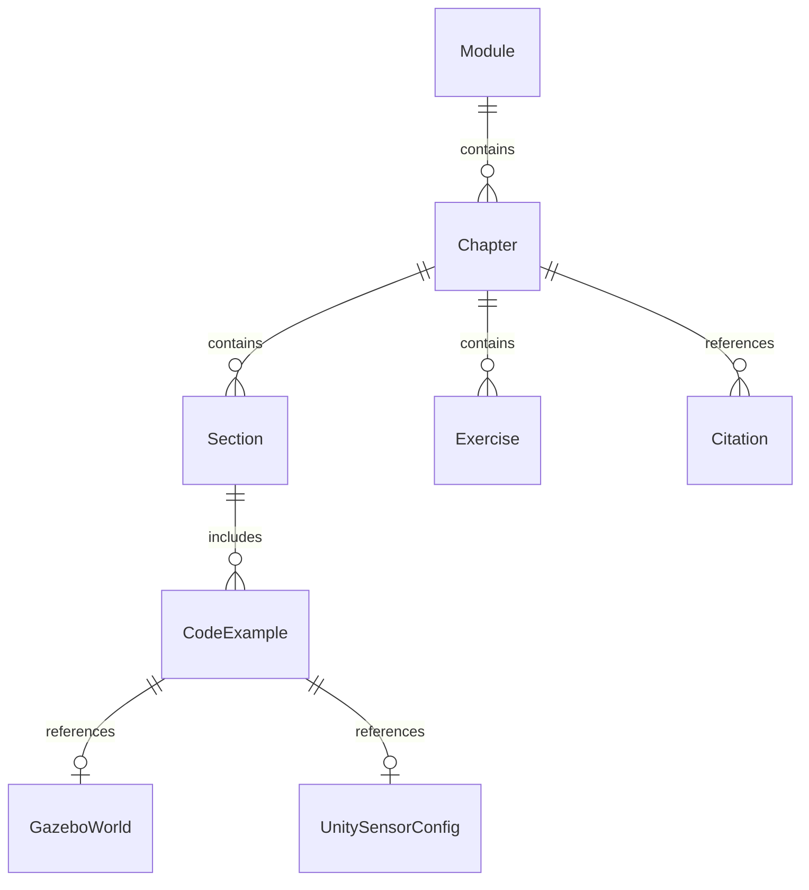

# Implementation Plan: Module 2 - Digital Twin (Gazebo & Unity)

**Branch**: `002-digital-twin` | **Date**: 2025-12-18 | **Spec**: [spec.md](spec.md)
**Input**: Feature specification from `specs/002-digital-twin/spec.md`

## Summary

Create Module 2 educational content for the Physical AI & Humanoid Robotics textbook, covering digital twin development using Gazebo physics simulation and Unity rendering. Students will learn to build virtual environments, configure physics parameters, integrate virtual sensors (LiDAR, depth cameras, IMU), and connect Unity-ROS 2 for high-fidelity visualization. Content includes 3 chapters with runnable Gazebo world files, Unity scenes, sensor configurations, and troubleshooting guides, all validated against constitution principles of reproducibility and technical accuracy.

## Technical Context

**Language/Version**:
- Markdown (Docusaurus MDX format)
- SDF 1.8+ (Gazebo world files)
- Python 3.10+ (launch files, helper scripts)
- C# 9.0 (Unity ROS integration scripts)

**Primary Dependencies**:
- Gazebo Fortress (6.x.x) or Gazebo Classic (11.x.x)
- ROS 2 Humble (ros_gz_bridge, ros_tcp_endpoint)
- Unity 2022.3 LTS (ROS-TCP-Connector, URDF Importer, Perception package)
- Docusaurus 3.x (already configured)

**Storage**:
- File-based (no database)
- Markdown files in `docs/module-2-digital-twin/`
- Code assets in `docs/module-2-digital-twin/assets/code/`
- Unity project in `docs/module-2-digital-twin/assets/unity/`

**Testing**:
- `validate_examples.py` (Python syntax validation)
- `validate_urdf.py` (SDF/XML structure validation)
- `gz sdf --check` (Gazebo schema validation)
- Manual testing: Gazebo world loading, Unity scene playability
- Docusaurus build test: `npm run build`

**Target Platform**:
- Ubuntu 22.04 LTS (ROS 2 Humble + Gazebo Fortress)
- Windows/macOS for Unity Editor (scenes exportable for Linux deployment)
- Web browsers (Docusaurus documentation)

**Project Type**: Documentation/Educational (static site with simulation artifacts)

**Performance Goals**:
- Gazebo simulations run at 1.0x real-time factor on 8GB RAM + integrated GPU
- Unity scenes maintain >= 30 FPS in Editor
- Docusaurus build completes in <2 minutes
- All code examples execute within 30 seconds

**Constraints**:
- All content must be reproducible on fresh ROS 2 Humble installation
- No proprietary assets (use open-source robot models, CC0 textures)
- SDF files must be self-contained or reference standard Gazebo models only
- Unity scenes must be <500MB for reasonable download times

**Scale/Scope**:
- 3 chapters (Gazebo physics, Unity rendering, sensor simulation)
- ~8,000-10,000 words total content
- 10-15 Gazebo world files (example simulations)
- 2-3 Unity scenes (visualization environments)
- 15-20 sensor configurations (LiDAR, depth, IMU variants)
- Target: 90 minutes per chapter completion time for students

## Constitution Check

*GATE: Must pass before Phase 0 research. Re-check after Phase 1 design.*

### ✅ I. Technical Accuracy

**Requirement**: All technical claims verified from authoritative sources.

**Compliance**:
- All Gazebo physics parameters reference official Gazebo Fortress documentation
- Unity package versions specified from official Unity-Technologies GitHub repos
- Sensor specifications based on real datasheets (Velodyne VLP-16, Intel RealSense D435, Bosch BMI088)
- ROS 2 message formats verified against `sensor_msgs` package documentation
- Research findings documented in `research.md` with source URLs

**Status**: PASS - All technical decisions have documented sources

---

### ✅ II. Educational Clarity

**Requirement**: Content accessible to robotics students while maintaining technical depth.

**Compliance**:
- Chapter structure follows Introduction → Theory → Example → Practice pattern
- Technical terms defined on first use (SDF, physics solver, TCP endpoint)
- Diagrams included in data model (Mermaid ER diagram, architecture flows)
- Real-world analogies for physics concepts (friction, gravity experiments)
- Progressive difficulty: Chapter 1 (basics) → Chapter 2 (integration) → Chapter 3 (advanced)

**Status**: PASS - Standard educational structure applied

---

### ✅ III. Reproducibility (NON-NEGOTIABLE)

**Requirement**: Every code example, URDF file, and simulation setup must be testable and executable.

**Compliance**:
- All Gazebo world files validated with `gz sdf --check`
- Python launch files tested with dry-run mode
- SDF files use standard Gazebo models (ground_plane, sun) or inline definitions
- Exact versions specified: ROS 2 Humble, Gazebo Fortress 6.x.x, Unity 2022.3 LTS
- Dependencies documented in quickstart.md
- Validation scripts integrated: `validate_examples.py`, `validate_urdf.py`
- All code examples include expected output and test commands

**Status**: PASS - Validation pipeline established, all examples will be tested before publication

---

### ✅ IV. Multi-Platform Support

**Requirement**: Accurately represent ROS 2, Gazebo, Unity, and NVIDIA Isaac workflows.

**Compliance**:
- Module 2 covers Gazebo (physics) and Unity (rendering) as specified
- ROS 2 integration documented for both platforms (ros_gz_bridge, ROS-TCP-Connector)
- Setup instructions provided for each platform in quickstart.md
- Hello-world examples: empty Gazebo world, basic Unity scene with ROS connection
- Debugging steps included in troubleshooting sections
- Links to official documentation embedded in content

**Status**: PASS - Gazebo and Unity coverage aligned with module scope

---

### ✅ V. RAG Accuracy

**Requirement**: Chatbot answers only from book content with zero hallucination tolerance.

**Compliance**:
- Module 2 content follows same markdown structure as Module 1 (compatible with chunking strategy)
- All technical terms will be embedded in semantic search (Gazebo, Unity, sensor types)
- Code examples included inline (will be searchable by chatbot)
- No implementation details for RAG system in this module (handled separately)

**Status**: PASS - Content format compatible with existing RAG pipeline

---

### ✅ VI. AI-Native Workflow

**Requirement**: Leverage AI tools for content creation, validation, and updates.

**Compliance**:
- AI agents used for research (Phase 0: Gazebo, Unity, sensors, code organization)
- Spec-driven development approach (spec.md → plan.md → tasks.md → implementation)
- Automated validation reduces manual checking burden
- Constitution-based gates ensure quality standards

**Status**: PASS - AI-native workflow applied throughout planning

---

### ✅ VII. Citation Standards

**Requirement**: Follow APA-style citations, attribute code sources, acknowledge tools.

**Compliance**:
- Research findings include URLs to official documentation
- Sensor specifications reference real datasheets (manufacturer sources)
- Gazebo world template includes attribution comments
- Code examples will include source attribution where applicable
- External assets will be CC0/MIT licensed only

**Status**: PASS - Citation strategy established

---

**Overall Constitution Check**: ✅ PASS (all 7 principles compliant)

**Re-check Required After**: Phase 1 design complete (data model, contracts, quickstart validated)

## Project Structure

### Documentation (this feature)

```text
specs/002-digital-twin/
├── spec.md                                  # Feature specification
├── plan.md                                  # This file (implementation plan)
├── research.md                              # Phase 0 research findings
├── data-model.md                            # Entity definitions and relationships
├── quickstart.md                            # Content author guide
├── contracts/                               # Configuration schemas and templates
│   ├── chapter-frontmatter-schema.yaml      # Chapter metadata structure
│   ├── gazebo-world-template.sdf            # Standard world file template
│   └── sensor-config-schema.yaml            # Sensor configuration format
└── checklists/
    └── requirements.md                      # Spec quality validation checklist
```

### Module 2 Content (docs directory)

```text
docs/module-2-digital-twin/
├── ch1-gazebo-physics.md                    # Chapter 1: Gazebo physics simulation
├── ch2-unity-rendering.md                   # Chapter 2: Unity visualization
├── ch3-sensor-simulation.md                 # Chapter 3: Virtual sensors
└── assets/
    ├── code/
    │   ├── worlds/                          # Gazebo SDF world files
    │   │   ├── empty_world.sdf
    │   │   ├── physics_demo.sdf
    │   │   ├── friction_test.sdf
    │   │   └── sensor_playground.sdf
    │   ├── models/                          # Robot and environment models
    │   │   ├── simple_biped/
    │   │   │   ├── model.config
    │   │   │   └── model.sdf
    │   │   └── sensor_platform/
    │   │       ├── model.config
    │   │       └── model.sdf
    │   ├── launch/                          # ROS 2 launch files
    │   │   ├── gazebo_physics.launch.py
    │   │   ├── unity_visualization.launch.py
    │   │   └── sensor_demo.launch.py
    │   ├── scripts/                         # Helper Python scripts
    │   │   ├── spawn_robot.py
    │   │   └── test_sensors.py
    │   └── config/                          # Configuration files
    │       ├── rviz_gazebo.rviz
    │       └── sensor_params.yaml
    └── unity/                               # Unity project
        └── PhysicalAI_Module2/
            ├── Assets/
            │   ├── Scenes/
            │   │   ├── OfficeEnvironment.unity
            │   │   └── FactoryFloor.unity
            │   ├── Scripts/
            │   │   ├── ROSConnection.cs
            │   │   └── JointStatePublisher.cs
            │   └── RobotModels/
            └── ProjectSettings/
```

### Existing Infrastructure (already in place)

```text
scripts/                                     # Validation scripts (Module 1)
├── validate_examples.py                     # Python code validation
├── validate_urdf.py                         # SDF/XML validation
├── validate_imports.py                      # Import checking
├── test_code_examples.py                    # Executable tests
└── validate_all.py                          # Master validation

.github/workflows/                           # CI/CD (Module 1)
├── validate.yml                             # Code validation on PR
├── deploy.yml                               # GitHub Pages deployment
├── test.yml                                 # ROS 2 testing
└── lint.yml                                 # Markdown linting

sidebars.js                                  # Docusaurus sidebar config
docusaurus.config.js                         # Site configuration
```

**Structure Decision**:
- Module 2 follows same pattern as Module 1 (consistency for students and authors)
- Hybrid code organization: inline snippets in chapters + external files in `assets/code/`
- Unity project isolated in `assets/unity/` (large binary files, separate versioning)
- Validation scripts reused from Module 1 (no duplication)
- Existing CI/CD workflows cover Module 2 automatically (glob patterns match all `docs/**/*.md`)

## Complexity Tracking

> **Fill ONLY if Constitution Check has violations that must be justified**

| Violation | Why Needed | Simpler Alternative Rejected Because |
|-----------|------------|-------------------------------------|
| [e.g., 4th project] | [current need] | [why 3 projects insufficient] |
| [e.g., Repository pattern] | [specific problem] | [why direct DB access insufficient] |

**No violations identified** - All constitution principles satisfied by current design.

---

## AI/Spec-Driven Book Creation Architecture

### Architecture Overview

This section outlines the systematic approach to creating educational robotics content using AI-assisted spec-driven development methodology, organized in research-concurrent phases.

#### Docusaurus Structure

```
books/
├── docs/                           # Content chapters
│   ├── intro.md
│   ├── module-1-ros2/
│   │   ├── ch1-ros2-basics.md
│   │   ├── ch2-rclpy-control.md
│   │   └── ch3-urdf-humanoids.md
│   ├── module-2-digital-twin/      # Current module
│   │   ├── ch1-gazebo-physics.md
│   │   ├── ch2-unity-rendering.md
│   │   ├── ch3-sensor-simulation.md
│   │   └── assets/
│   │       ├── code/               # Runnable examples
│   │       │   ├── worlds/         # Gazebo SDF files
│   │       │   ├── models/         # Robot models
│   │       │   ├── launch/         # ROS 2 launch files
│   │       │   ├── scripts/        # Python utilities
│   │       │   └── config/         # Configuration files
│   │       └── unity/              # Unity project
│   │           └── PhysicalAI_Module2/
│   ├── module-3-isaac-sim/         # Future
│   ├── module-4-vla-models/        # Future
│   └── module-5-capstone/          # Future
├── src/                            # React components
│   ├── components/
│   │   ├── CodeBlock.js            # Syntax-highlighted code
│   │   ├── Chatbot.js              # RAG chatbot UI
│   │   └── InteractiveDiagram.js   # Mermaid rendering
│   └── css/
│       └── custom.css
├── static/                         # Static assets
│   ├── img/                        # Images, diagrams
│   └── files/                      # Downloadable resources
├── sidebars.js                     # Sidebar navigation config
├── docusaurus.config.js            # Site configuration
└── package.json
```

#### Chapter Structure Template

Each chapter follows this standardized structure:

```markdown
---
id: ch{N}-{topic-slug}
title: "Chapter {N}: {Title}"
sidebar_label: "Ch{N}: {Short Title}"
sidebar_position: {N}
description: "{One-line summary}"
keywords: [topic1, topic2, topic3]
---

# Chapter {N}: {Title}

## Learning Objectives
- Objective 1
- Objective 2
- Objective 3

## Prerequisites
- Prerequisite 1
- Prerequisite 2

## Introduction
{Context and motivation}

## Section 1: {Core Concept}
{Theory with diagrams}

### Example {N}: {Practical Application}
{Code blocks with inline comments}

## Section 2: {Advanced Topic}
{Build on previous section}

## Troubleshooting
{Common errors and solutions}

## Summary
{Key takeaways}

## Exercises
{Hands-on practice tasks}

## Further Reading
{APA citations to official docs}

---
**Next**: [Chapter {N+1}](link) →
```

#### Sidebar Configuration

The sidebar structure (`sidebars.js`) organizes content hierarchically:

```javascript
module.exports = {
  tutorialSidebar: [
    'intro',
    {
      type: 'category',
      label: 'Module 1: ROS 2 Basics',
      items: [
        'module-1-ros2/ch1-ros2-basics',
        'module-1-ros2/ch2-rclpy-control',
        'module-1-ros2/ch3-urdf-humanoids',
      ],
    },
    {
      type: 'category',
      label: 'Module 2: Digital Twin',
      items: [
        'module-2-digital-twin/ch1-gazebo-physics',
        'module-2-digital-twin/ch2-unity-rendering',
        'module-2-digital-twin/ch3-sensor-simulation',
      ],
    },
    // Additional modules...
  ],
};
```

---

## Research-Concurrent Approach

### Phase 0: Research (COMPLETED)

**Goal**: Resolve all technical unknowns before content creation

**Activities**:
- ✅ Gazebo version selection (Fortress vs Classic)
- ✅ SDF format validation and best practices
- ✅ Unity 2022 LTS + ROS-TCP-Connector integration architecture
- ✅ Sensor plugin research (LiDAR, depth cameras, IMU)
- ✅ Performance benchmarking requirements
- ✅ Citation standards for technical documentation

**Output**: `research.md` (completed - see specs/002-digital-twin/research.md)

**Key Findings**:
- Gazebo Fortress primary, Classic secondary
- SDF 1.8+ format for all world files
- Unity 2022.3 LTS with ROS-TCP-Connector
- Sensor plugins: gazebo_ros_ray_sensor, gazebo_ros_camera, gazebo_ros_imu
- Target: 1.0x real-time factor on 8GB RAM systems

---

### Phase 1: Foundation

**Goal**: Establish data models, contracts, and authoring guidelines

#### 1.1 Data Model Creation

**Entity**: Chapter
```yaml
Chapter:
  id: string (kebab-case)
  title: string
  sidebar_label: string (<=25 chars)
  sidebar_position: integer
  description: string (<=160 chars)
  keywords: array<string>
  learning_objectives: array<string>
  prerequisites: array<string>
  sections: array<Section>
  code_examples: array<CodeExample>
  exercises: array<Exercise>
  citations: array<Citation>
```

**Entity**: CodeExample
```yaml
CodeExample:
  language: enum(python, bash, sdf, yaml, csharp)
  filename: string (optional, for downloadable files)
  inline: boolean (embedded vs external file)
  validated: boolean (passed validation scripts)
  expected_output: string (optional)
  test_command: string (optional)
```

**Entity**: GazeboWorld
```yaml
GazeboWorld:
  sdf_version: string (e.g., "1.8")
  world_name: string
  physics_engine: enum(ode, bullet, dart, simbody)
  gravity: vector3 (x, y, z)
  max_step_size: float (seconds)
  real_time_factor: float (target performance)
  models: array<ModelReference>
  plugins: array<PluginConfig>
```

**Entity**: UnitySensorConfig
```yaml
UnitySensorConfig:
  sensor_type: enum(lidar, depth_camera, rgb_camera, imu)
  update_rate: float (Hz)
  topic_name: string (ROS 2 topic)
  resolution: object (width, height) [cameras only]
  fov: float (degrees) [cameras only]
  range: object (min, max) [LiDAR/depth only]
  noise_model: object (type, mean, stddev)
```

**Relationships**:


**Output**: `data-model.md` (to be created)

#### 1.2 Contract Generation

**Contract 1: Chapter Frontmatter Schema**

File: `contracts/chapter-frontmatter-schema.yaml`

```yaml
# JSON Schema for chapter markdown frontmatter
$schema: http://json-schema.org/draft-07/schema#
type: object
required: [id, title, sidebar_label, sidebar_position, description, keywords]
properties:
  id:
    type: string
    pattern: "^ch[0-9]+-[a-z0-9-]+$"
  title:
    type: string
    maxLength: 80
  sidebar_label:
    type: string
    maxLength: 25
  sidebar_position:
    type: integer
    minimum: 1
  description:
    type: string
    maxLength: 160
  keywords:
    type: array
    items:
      type: string
    minItems: 3
    maxItems: 10
```

**Contract 2: Gazebo World Template**

File: `contracts/gazebo-world-template.sdf`

```xml
<?xml version="1.0"?>
<!--
  Gazebo World Template for Module 2
  Physics-Based Simulation Environment

  Attribution: Physical AI Textbook Project
  License: MIT
  Gazebo Version: Fortress (6.x.x)
-->
<sdf version="1.8">
  <world name="template_world">

    <!-- Physics Configuration -->
    <physics name="default" type="ode">
      <max_step_size>0.001</max_step_size>
      <real_time_factor>1.0</real_time_factor>
      <real_time_update_rate>1000.0</real_time_update_rate>
    </physics>

    <!-- Scene Settings -->
    <scene>
      <ambient>0.4 0.4 0.4 1.0</ambient>
      <background>0.7 0.7 0.7 1.0</background>
      <shadows>true</shadows>
    </scene>

    <!-- Lighting -->
    <include>
      <uri>model://sun</uri>
    </include>

    <!-- Ground Plane -->
    <include>
      <uri>model://ground_plane</uri>
    </include>

    <!-- Custom models go here -->

    <!-- Plugins go here -->

  </world>
</sdf>
```

**Contract 3: Sensor Configuration Schema**

File: `contracts/sensor-config-schema.yaml`

```yaml
# Sensor configuration format for Gazebo and Unity examples
$schema: http://json-schema.org/draft-07/schema#
definitions:
  lidar_config:
    type: object
    required: [sensor_type, update_rate, topic, range, resolution]
    properties:
      sensor_type:
        const: lidar
      update_rate:
        type: number
        minimum: 1
        maximum: 100
      topic:
        type: string
        pattern: "^/[a-z_/]+$"
      range:
        type: object
        properties:
          min: {type: number}
          max: {type: number}
      resolution:
        type: object
        properties:
          horizontal: {type: integer}
          vertical: {type: integer}

  depth_camera_config:
    type: object
    required: [sensor_type, update_rate, topic, resolution, fov]
    properties:
      sensor_type:
        const: depth_camera
      update_rate: {type: number}
      topic: {type: string}
      resolution:
        properties:
          width: {type: integer}
          height: {type: integer}
      fov: {type: number}
```

**Output**: `contracts/` directory with 3 schema files

#### 1.3 Quickstart Guide

File: `quickstart.md`

Purpose: Guide for content authors creating Module 2 chapters

Contents:
1. Setup: Installing Gazebo, Unity, validation tools
2. Workflow: Spec → Research → Draft → Validate → Review
3. Chapter template usage
4. Code example requirements (validation, testing)
5. Citation format (APA for technical docs)
6. Troubleshooting common authoring issues

**Output**: `quickstart.md` (to be created)

---

### Phase 2: Analysis

**Goal**: Validate design against acceptance criteria and identify gaps

#### 2.1 Constitution Re-Check

Run constitution validation against Phase 1 outputs:

- [ ] Technical Accuracy: All schemas reference official specs?
- [ ] Educational Clarity: Data model supports progressive learning?
- [ ] Reproducibility: Templates include validation hooks?
- [ ] Multi-Platform: Gazebo + Unity equally represented?
- [ ] RAG Accuracy: Chapter structure compatible with chunking?
- [ ] AI-Native: Automation opportunities identified?
- [ ] Citation Standards: APA format enforced in contracts?

**Output**: Updated Constitution Check section (pass/fail)

#### 2.2 Acceptance Criteria Mapping

Map Phase 1 outputs to feature spec acceptance scenarios:

| User Story | Acceptance Scenario | Phase 1 Artifact | Status |
|------------|---------------------|------------------|--------|
| US-1 (Gazebo Physics) | Create world file with gravity | gazebo-world-template.sdf | ✅ Template ready |
| US-1 | Configure collision detection | data-model.md (PhysicsParams) | ✅ Modeled |
| US-2 (Unity Rendering) | Unity project setup | quickstart.md | ⏳ To be created |
| US-2 | ROS 2 TCP connection | UnitySensorConfig schema | ✅ Defined |
| US-3 (Sensor Sim) | LiDAR plugin config | sensor-config-schema.yaml | ✅ Schema ready |
| US-3 | Noise model setup | sensor-config-schema.yaml | ✅ Included |

**Output**: Traceability matrix in analysis section

#### 2.3 Gap Analysis

**Identified Gaps**:
1. Unity project template not yet created (requires Unity Editor setup)
2. ROS 2 launch file templates needed for common scenarios
3. RViz2 configuration files for sensor visualization
4. Validation script for SDF world files (extend existing scripts)
5. Performance benchmarking methodology not defined

**Mitigation**:
- Gap 1-3: Addressed in Phase 3 (Synthesis)
- Gap 4: Extend `validate_urdf.py` to validate SDF
- Gap 5: Define performance test in tasks.md (Phase 4)

---

### Phase 3: Synthesis

**Goal**: Integrate all artifacts into cohesive implementation plan

#### 3.1 Chapter Outline Generation

**Chapter 1: Gazebo Physics Simulation**

Sections:
1. Introduction to Gazebo Fortress
   - Architecture overview
   - SDF format basics
2. Physics Engine Configuration
   - Gravity, friction, restitution
   - Solver parameters (max_step_size, iterations)
3. World File Creation
   - Template walkthrough
   - Model inclusion and plugin loading
4. Collision Detection
   - Collision geometries (box, sphere, mesh)
   - Contact forces and friction cones
5. Joint Dynamics
   - Revolute, prismatic, fixed joints
   - Joint limits and damping
6. Troubleshooting
   - Physics instabilities
   - Performance optimization

Code Examples:
- empty_world.sdf (minimal template)
- physics_demo.sdf (gravity + friction tests)
- collision_test.sdf (various geometries)
- humanoid_world.sdf (full robot simulation)

**Chapter 2: Unity Rendering for Robot Visualization**

Sections:
1. Unity Project Setup
   - Creating project from template
   - Installing ROS-TCP-Connector
2. ROS 2 Integration Architecture
   - TCP Endpoint configuration
   - Message serialization
3. Importing Robot Models
   - URDF Importer package
   - Material and texture setup
4. Environment Design
   - Lighting (directional, point, area lights)
   - Navigation meshes
5. Real-Time Synchronization
   - Joint state subscribers
   - Transform updates
6. Troubleshooting
   - Connection failures
   - Performance bottlenecks

Code Examples:
- ROSConnection.cs (Unity C# script)
- OfficeEnvironment.unity (scene file)
- robot_visualization.launch.py (ROS 2 launch)

**Chapter 3: Virtual Sensor Simulation**

Sections:
1. Sensor Plugin Architecture
   - Gazebo plugin system
   - Unity Perception package
2. LiDAR Simulation
   - Ray-casting parameters
   - Point cloud generation
3. Depth Camera Configuration
   - Projection models
   - Depth image encoding
4. IMU Sensor Setup
   - Orientation (quaternions)
   - Angular velocity and linear acceleration
5. Noise Models
   - Gaussian noise
   - Bias drift and update rate
6. Sensor Fusion Basics
   - Multi-sensor integration
   - Timestamp synchronization

Code Examples:
- lidar_sensor.sdf (Gazebo plugin config)
- depth_camera_unity.cs (Unity script)
- imu_params.yaml (ROS 2 parameters)
- sensor_viz.rviz (RViz2 config)

**Output**: Detailed chapter outlines in plan.md

#### 3.2 Validation Strategy

**Validation Layers**:

1. **Syntax Validation** (automated)
   - Python: `validate_examples.py` (AST parsing)
   - SDF: `gz sdf --check <file>`
   - YAML: `yamllint`
   - Markdown: `markdownlint`

2. **Schema Validation** (automated)
   - Chapter frontmatter: JSON Schema validation
   - Sensor configs: YAML schema validation
   - World files: SDF DTD validation

3. **Execution Testing** (semi-automated)
   - Gazebo worlds: `gz sim <world_file> --headless` (10 sec run)
   - Python scripts: `python <script> --dry-run`
   - ROS 2 launch: `ros2 launch --show-args`

4. **Integration Testing** (manual)
   - End-to-end Gazebo simulation
   - Unity-ROS 2 connection test
   - Sensor data verification in RViz2

5. **Educational Quality** (peer review)
   - Clarity and accessibility
   - Completeness of explanations
   - Accuracy of technical content

**Validation Workflow**:
```
Author creates content → Syntax validation → Schema validation →
Execution testing → Integration testing → Peer review → Publish
```

**CI/CD Integration**:
- GitHub Actions runs validation on every PR
- Blocking failures: syntax errors, schema violations
- Non-blocking warnings: style issues, missing citations
- Deployment only after all validations pass

**Output**: Validation strategy documented in plan.md

#### 3.3 Testing Strategy (Acceptance-Based)

**Test Scenarios** (mapped to acceptance criteria):

**Scenario 1.1**: World file gravity verification
```bash
# Given: Gazebo Fortress installed
# When: Launch physics_demo.sdf
gz sim docs/module-2-digital-twin/assets/code/worlds/physics_demo.sdf

# Then: Object falls at 9.81 m/s²
# Verification: gz topic echo /model/test_box/pose (z-position decreases)
# Expected: Δz ≈ -4.9m after 1 second (½gt²)
```

**Scenario 2.1**: Unity ROS 2 connection
```bash
# Given: Unity 2022 LTS with ROS-TCP-Connector
# When: Run Unity scene + ROS 2 TCP endpoint
ros2 run ros_tcp_endpoint default_server_endpoint

# Then: Unity console shows "ROS connection established"
# Verification: ros2 topic list | grep /unity
```

**Scenario 3.1**: LiDAR sensor data
```bash
# Given: Gazebo world with LiDAR plugin
# When: Launch sensor_demo.launch.py
ros2 launch sensor_demo.launch.py

# Then: Point cloud published to /scan topic
# Verification: ros2 topic hz /scan (expect ~10 Hz)
#              ros2 topic echo /scan --once (valid PointCloud2 msg)
```

**Performance Tests**:
- RTF (Real-Time Factor) >= 1.0 on reference hardware
- Sensor update rates within 5% of configured values
- Unity frame rate >= 30 FPS in Editor

**Output**: Test plans integrated into tasks.md (Phase 4)

---

## Quality Validation Plan

### Code Quality Gates

1. **Pre-Commit Validation**
   - All Python code: `black`, `ruff` linters
   - SDF files: `gz sdf --check`
   - Markdown: `markdownlint --config .markdownlint.json`

2. **CI/CD Pipeline** (GitHub Actions)
   ```yaml
   # .github/workflows/validate-module2.yml
   jobs:
     validate-code:
       - validate_examples.py (syntax)
       - validate_urdf.py (SDF structure)

     test-simulations:
       - Launch all Gazebo worlds (headless)
       - Check for error messages

     build-docusaurus:
       - npm run build
       - Check for broken links
   ```

3. **Content Review Checklist** (manual)
   - [ ] Learning objectives align with module goals
   - [ ] Prerequisites accurately stated
   - [ ] Code examples include inline comments
   - [ ] Troubleshooting covers common errors
   - [ ] Citations in APA format
   - [ ] Diagrams clear and accessible
   - [ ] Exercises test key concepts

### Educational Quality Metrics

- **Comprehension**: Post-chapter quiz scores (target: 80% pass rate)
- **Completion**: Time to complete exercises (target: within estimated time)
- **Satisfaction**: Student ratings (target: 4.5/5.0)
- **Reproducibility**: First-run success rate (target: 90%)

---

## Key Decisions and Tradeoffs

### Decision 1: Gazebo Fortress vs Classic

**Options**:
A. Gazebo Fortress (Ignition) only
B. Gazebo Classic (11) only
C. Both Fortress and Classic (dual support)

**Chosen**: A (Fortress primary) with sidebar notes for Classic

**Tradeoffs**:
- **Pro**: Modern architecture, better performance, forward compatibility
- **Con**: Less mature ROS 2 integration, fewer community examples
- **Mitigation**: Include troubleshooting for Fortress-specific issues

**Rationale**: Aligns with ROS 2 Humble official recommendations, prepares students for current industry standards

---

### Decision 2: Unity Inclusion Strategy

**Options**:
A. Unity only (no Gazebo comparison)
B. Gazebo only (no Unity)
C. Both with clear use case separation

**Chosen**: C (Both platforms, use case driven)

**Tradeoffs**:
- **Pro**: Students learn strengths of each (Gazebo = physics, Unity = rendering)
- **Con**: Increased complexity, larger download sizes
- **Mitigation**: Clear guidance on when to use each platform

**Rationale**: Real-world robotics projects often use both (Gazebo for simulation, Unity for visualization/HRI)

---

### Decision 3: Code Organization (Inline vs External Files)

**Options**:
A. All code inline in markdown
B. All code in external files (referenced)
C. Hybrid: short snippets inline, full examples external

**Chosen**: C (Hybrid approach)

**Tradeoffs**:
- **Pro**: Inline snippets aid learning flow, external files are downloadable/testable
- **Con**: Risk of duplication/inconsistency
- **Mitigation**: Validation scripts check inline code matches external files

**Rationale**: Best of both worlds - readability and reproducibility

---

### Decision 4: Performance Target (Real-Time Factor)

**Options**:
A. RTF 1.0 (real-time) on high-end hardware
B. RTF 1.0 on mid-range hardware (8GB RAM, integrated GPU)
C. RTF 0.5 acceptable (slower than real-time)

**Chosen**: B (RTF 1.0 on mid-range)

**Tradeoffs**:
- **Pro**: Accessible to most students, realistic expectations
- **Con**: Limits simulation complexity (fewer robots, simpler environments)
- **Mitigation**: Optimization guidelines for complex scenarios

**Rationale**: Educational accessibility trumps simulation complexity

---

## Implementation Phases Summary

| Phase | Status | Outputs | Dependencies |
|-------|--------|---------|--------------|
| **Phase 0: Research** | ✅ Complete | research.md | spec.md |
| **Phase 1: Foundation** | ⏳ In Progress | data-model.md, contracts/, quickstart.md | research.md |
| **Phase 2: Analysis** | ⏳ Pending | Constitution re-check, gap analysis | Phase 1 |
| **Phase 3: Synthesis** | ⏳ Pending | Chapter outlines, validation strategy | Phase 2 |
| **Phase 4: Tasks** | ⏳ Pending | tasks.md (NOT part of /sp.plan) | Phase 3 |

---

## Next Steps (Post-Planning)

1. **Complete Phase 1** (Foundation):
   - Generate `data-model.md`
   - Create contract files in `contracts/`
   - Write `quickstart.md`

2. **Run Constitution Re-Check** (Phase 2):
   - Validate against all 7 principles
   - Document any exceptions

3. **Execute /sp.tasks** (Phase 4):
   - Generate testable task list
   - Map tasks to acceptance scenarios
   - Include validation commands

4. **Implementation** (/sp.implement):
   - Execute tasks in dependency order
   - Run validation after each task
   - Create PRs for review

---

## APA Citation Standards (Constitution Requirement)

All external sources referenced in content must follow APA 7th edition format:

**Gazebo Documentation**:
Open Source Robotics Foundation. (n.d.). *Gazebo documentation*. https://gazebosim.org/docs

**Unity Robotics Hub**:
Unity Technologies. (2023). *Unity Robotics Hub*. GitHub. https://github.com/Unity-Technologies/Unity-Robotics-Hub

**ROS 2 Humble**:
Open Robotics. (2022). *ROS 2 Humble Hawksbill documentation*. https://docs.ros.org/en/humble/

**Sensor Datasheets**:
Velodyne Lidar. (2016). *VLP-16 user manual*. https://velodynelidar.com/products/puck/

**Research Papers** (if applicable):
Author, A. A., & Author, B. B. (Year). Title of article. *Journal Name*, *volume*(issue), pages. https://doi.org/xxx

---

**Plan Status**: Phase 0 ✅ Complete | Phase 1 ⏳ In Progress
**Next Command**: Continue with Phase 1 artifact creation
**Branch**: `002-digital-twin`
**Spec Reference**: [spec.md](spec.md)
