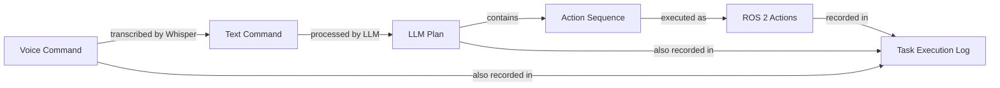

# Data Model: Module 4 VLA Models

**Feature**: Module 4 - Vision-Language-Action (VLA) Models
**Date**: 2025-12-22
**Purpose**: Define key entities, their attributes, relationships, and validation rules for the VLA pipeline

---

## Overview

This document defines the data structures that flow through the VLA (Vision-Language-Action) pipeline: from voice input through language understanding to robot action execution. These entities are derived from the functional requirements in spec.md and represent the core data contracts for the system.

---

## Entity Relationship Diagram



---

## Core Entities

### 1. Voice Command

Represents spoken natural language input from the user, captured and transcribed by Whisper ASR.

**Attributes**:

| Attribute | Type | Required | Description | Validation Rules |
|-----------|------|----------|-------------|------------------|
| `command_id` | string (UUID) | Yes | Unique identifier for this voice command | Must be valid UUID v4 |
| `raw_audio` | binary/bytes | Yes | Original audio recording | WAV or MP3 format, max 60 seconds |
| `transcribed_text` | string | Yes | Text output from Whisper | Max 500 characters, non-empty |
| `language_code` | string | Yes | ISO 639-1 language code | e.g., "en", "es", "fr" |
| `confidence_score` | float | Yes | Whisper's confidence in transcription | Range [0.0, 1.0] |
| `timestamp` | datetime (ISO 8601) | Yes | When command was recorded | UTC format |
| `audio_duration_seconds` | float | Yes | Length of audio clip | Range (0, 60] |
| `whisper_model_used` | string | Yes | Which Whisper model transcribed | One of: tiny, base, small, medium, large |

**Relationships**:
- One Voice Command → One LLM Plan (after processing)
- One Voice Command → One Task Execution Log entry

**State Transitions**:
1. `RECORDED` - Audio captured, not yet transcribed
2. `TRANSCRIBED` - Whisper processing complete
3. `SENT_TO_LLM` - Passed to language model for planning
4. `FAILED` - Transcription or processing error

**Example**:
```json
{
  "command_id": "550e8400-e29b-41d4-a716-446655440000",
  "raw_audio": "<binary data>",
  "transcribed_text": "Navigate to the kitchen and pick up the red cup",
  "language_code": "en",
  "confidence_score": 0.97,
  "timestamp": "2025-12-22T14:30:45Z",
  "audio_duration_seconds": 3.2,
  "whisper_model_used": "base"
}
```

---

### 2. LLM Plan

Structured action sequence generated by the language model in response to a voice command. Translates human intent into robot-executable steps.

**Attributes**:

| Attribute | Type | Required | Description | Validation Rules |
|-----------|------|----------|-------------|------------------|
| `plan_id` | string (UUID) | Yes | Unique identifier for this plan | Must be valid UUID v4 |
| `source_command_id` | string (UUID) | Yes | Reference to originating Voice Command | Must reference existing Voice Command |
| `task_description` | string | Yes | Natural language summary of task | Max 200 characters |
| `action_list` | array of Action | Yes | Ordered sequence of actions to execute | Min 1, max 20 actions |
| `parameters` | object | No | Additional task-specific parameters | JSON object, max 1KB |
| `constraints` | array of string | Yes | Safety and workspace constraints | e.g., ["stay_within_bounds", "avoid_obstacles"] |
| `safety_checks` | array of SafetyCheck | Yes | Validation rules that must pass | Min 1 safety check required |
| `estimated_duration_seconds` | float | No | LLM's estimate of task duration | Range (0, 600] |
| `confidence_score` | float | Yes | LLM's confidence in plan validity | Range [0.0, 1.0] |
| `timestamp` | datetime (ISO 8601) | Yes | When plan was generated | UTC format |
| `llm_model_used` | string | Yes | Which LLM generated plan | e.g., "gpt-4", "llama-7b" |
| `prompt_tokens` | integer | No | Tokens used in prompt | For cost tracking |
| `completion_tokens` | integer | No | Tokens in LLM response | For cost tracking |

**Nested Entity: Action**:

| Attribute | Type | Required | Description | Validation Rules |
|-----------|------|----------|-------------|------------------|
| `action_type` | string | Yes | ROS 2 action name | Must be valid ROS 2 action (e.g., "navigate_to_pose", "grasp_object") |
| `goal_parameters` | object | Yes | Parameters for this action | Must match action's goal schema |
| `timeout_seconds` | float | Yes | Max time to wait for completion | Range (0, 300] |
| `retry_count` | integer | No | How many times to retry on failure | Range [0, 3], default 0 |

**Nested Entity: SafetyCheck**:

| Attribute | Type | Required | Description | Validation Rules |
|-----------|------|----------|-------------|------------------|
| `check_type` | string | Yes | Type of safety validation | One of: "workspace_bounds", "collision_check", "battery_level", "action_exists" |
| `condition` | string | Yes | Condition that must be true | Logical expression or constraint description |
| `error_message` | string | Yes | Message if check fails | Max 200 characters |

**Relationships**:
- One LLM Plan → One Voice Command (source)
- One LLM Plan → Many ROS 2 Actions (execution)
- One LLM Plan → One Task Execution Log entry

**State Transitions**:
1. `GENERATED` - LLM produced plan, not yet validated
2. `VALIDATED` - Safety checks passed
3. `IN_PROGRESS` - Actions being executed
4. `COMPLETED` - All actions succeeded
5. `FAILED` - Action(s) failed or safety check blocked execution
6. `REPLANNING` - Requesting new plan from LLM due to failure

**Example**:
```json
{
  "plan_id": "7c9e6679-7425-40de-944b-e07fc1f90ae7",
  "source_command_id": "550e8400-e29b-41d4-a716-446655440000",
  "task_description": "Navigate to kitchen, detect and grasp red cup",
  "action_list": [
    {
      "action_type": "navigate_to_pose",
      "goal_parameters": {
        "pose": {
          "position": {"x": 5.0, "y": 3.0, "z": 0.0},
          "orientation": {"w": 1.0, "x": 0.0, "y": 0.0, "z": 0.0}
        },
        "frame_id": "map"
      },
      "timeout_seconds": 120.0,
      "retry_count": 1
    },
    {
      "action_type": "detect_object",
      "goal_parameters": {
        "object_color": "red",
        "object_type": "cup",
        "search_radius_meters": 2.0
      },
      "timeout_seconds": 30.0,
      "retry_count": 0
    },
    {
      "action_type": "grasp_object",
      "goal_parameters": {
        "object_id": "detected_object_id",
        "grasp_type": "top_down"
      },
      "timeout_seconds": 45.0,
      "retry_count": 1
    }
  ],
  "constraints": [
    "stay_within_workspace_bounds",
    "avoid_collision_with_obstacles",
    "battery_level > 20%"
  ],
  "safety_checks": [
    {
      "check_type": "workspace_bounds",
      "condition": "5.0 <= x <= 10.0 AND 0.0 <= y <= 5.0",
      "error_message": "Target pose outside allowed workspace"
    },
    {
      "check_type": "action_exists",
      "condition": "All action_types exist in ROS 2 action server registry",
      "error_message": "Invalid action type detected"
    }
  ],
  "estimated_duration_seconds": 180.0,
  "confidence_score": 0.92,
  "timestamp": "2025-12-22T14:30:47Z",
  "llm_model_used": "gpt-4",
  "prompt_tokens": 450,
  "completion_tokens": 320
}
```

---

### 3. ROS 2 Action

Represents an executable robot behavior triggered by the LLM plan. Maps to actual ROS 2 action server calls.

**Attributes**:

| Attribute | Type | Required | Description | Validation Rules |
|-----------|------|----------|-------------|------------------|
| `action_id` | string (UUID) | Yes | Unique identifier for this action instance | Must be valid UUID v4 |
| `plan_id` | string (UUID) | Yes | Reference to parent LLM Plan | Must reference existing LLM Plan |
| `action_type` | string | Yes | ROS 2 action name | Must match ROS 2 action interface |
| `goal_parameters` | object | Yes | Goal message for ROS 2 action | Must conform to action's goal schema |
| `status` | string | Yes | Current execution status | One of: PENDING, IN_PROGRESS, SUCCEEDED, FAILED, CANCELLED |
| `result` | object | No | Result message from action server | Populated when status is SUCCEEDED or FAILED |
| `feedback` | array of Feedback | No | Periodic updates during execution | Optional, for long-running actions |
| `start_timestamp` | datetime (ISO 8601) | Yes | When action execution began | UTC format |
| `end_timestamp` | datetime (ISO 8601) | No | When action completed/failed | UTC format, null if still in progress |
| `duration_seconds` | float | No | Actual execution time | Calculated from start/end timestamps |
| `error_message` | string | No | Description of failure if status=FAILED | Max 500 characters |
| `retry_attempt` | integer | Yes | Which retry this is (0 = first attempt) | Range [0, 3] |

**Nested Entity: Feedback**:

| Attribute | Type | Required | Description | Validation Rules |
|-----------|------|----------|-------------|------------------|
| `timestamp` | datetime (ISO 8601) | Yes | When feedback was received | UTC format |
| `message` | string | Yes | Feedback content | e.g., "Navigation 50% complete, 10m remaining" |
| `progress_percentage` | float | No | Completion percentage | Range [0.0, 100.0] |

**Relationships**:
- Many ROS 2 Actions → One LLM Plan (parent)
- One ROS 2 Action → One Task Execution Log entry (recorded)

**State Transitions**:
1. `PENDING` - Queued for execution
2. `IN_PROGRESS` - Action server processing
3. `SUCCEEDED` - Action completed successfully
4. `FAILED` - Action failed (may trigger retry or replanning)
5. `CANCELLED` - Preempted by user or safety system

**Example**:
```json
{
  "action_id": "9b5f8a1c-3d7e-4f2b-8c9a-1e6f7d8c9b5a",
  "plan_id": "7c9e6679-7425-40de-944b-e07fc1f90ae7",
  "action_type": "navigate_to_pose",
  "goal_parameters": {
    "pose": {
      "position": {"x": 5.0, "y": 3.0, "z": 0.0},
      "orientation": {"w": 1.0, "x": 0.0, "y": 0.0, "z": 0.0}
    },
    "frame_id": "map"
  },
  "status": "SUCCEEDED",
  "result": {
    "final_pose": {
      "position": {"x": 5.02, "y": 2.98, "z": 0.0},
      "orientation": {"w": 0.99, "x": 0.0, "y": 0.0, "z": 0.01}
    },
    "distance_traveled": 8.5
  },
  "feedback": [
    {
      "timestamp": "2025-12-22T14:31:00Z",
      "message": "Navigation in progress: 25% complete",
      "progress_percentage": 25.0
    },
    {
      "timestamp": "2025-12-22T14:31:30Z",
      "message": "Navigation in progress: 75% complete",
      "progress_percentage": 75.0
    }
  ],
  "start_timestamp": "2025-12-22T14:30:50Z",
  "end_timestamp": "2025-12-22T14:31:45Z",
  "duration_seconds": 55.0,
  "error_message": null,
  "retry_attempt": 0
}
```

---

### 4. Task Execution Log

Comprehensive record of the complete VLA pipeline execution for a single voice command. Used for debugging, performance analysis, and learning.

**Attributes**:

| Attribute | Type | Required | Description | Validation Rules |
|-----------|------|----------|-------------|------------------|
| `log_id` | string (UUID) | Yes | Unique identifier for this log entry | Must be valid UUID v4 |
| `voice_input` | VoiceCommand | Yes | Original voice command | Embedded Voice Command object |
| `llm_response` | LLMPlan | Yes | Generated action plan | Embedded LLM Plan object |
| `actions_executed` | array of ROS2Action | Yes | All actions attempted | Ordered list of ROS 2 Action objects |
| `outcomes` | array of Outcome | Yes | Result for each action | One outcome per action |
| `errors` | array of Error | No | Any errors encountered | Empty if all succeeded |
| `overall_status` | string | Yes | Final task status | One of: SUCCESS, PARTIAL_SUCCESS, FAILURE |
| `total_duration_seconds` | float | Yes | End-to-end time | From voice input to final action completion |
| `success_rate` | float | Yes | Percentage of actions that succeeded | Range [0.0, 1.0] |
| `timestamp_start` | datetime (ISO 8601) | Yes | When task began | UTC format |
| `timestamp_end` | datetime (ISO 8601) | Yes | When task completed | UTC format |
| `cost_estimate_usd` | float | No | Total API costs (if using cloud LLM) | For cost tracking |

**Nested Entity: Outcome**:

| Attribute | Type | Required | Description | Validation Rules |
|-----------|------|----------|-------------|------------------|
| `action_id` | string (UUID) | Yes | Reference to ROS 2 Action | Must match Action object |
| `result` | string | Yes | Outcome status | One of: "success", "failure", "cancelled" |
| `reason` | string | No | Explanation for result | Populated if failure or cancellation |

**Nested Entity: Error**:

| Attribute | Type | Required | Description | Validation Rules |
|-----------|------|----------|-------------|------------------|
| `stage` | string | Yes | Where in pipeline error occurred | One of: "transcription", "llm_planning", "action_execution", "safety_validation" |
| `error_type` | string | Yes | Error category | e.g., "APITimeout", "ValidationFailed", "ActionFailed" |
| `message` | string | Yes | Error description | Max 500 characters |
| `timestamp` | datetime (ISO 8601) | Yes | When error occurred | UTC format |
| `recoverable` | boolean | Yes | Can system recover automatically? | true if retry possible |

**Relationships**:
- One Task Execution Log → One Voice Command (source)
- One Task Execution Log → One LLM Plan (generated plan)
- One Task Execution Log → Many ROS 2 Actions (executed actions)

**Example**:
```json
{
  "log_id": "2f8d9c3a-4e5b-6c7d-8e9f-0a1b2c3d4e5f",
  "voice_input": {
    "command_id": "550e8400-e29b-41d4-a716-446655440000",
    "transcribed_text": "Navigate to the kitchen and pick up the red cup",
    "confidence_score": 0.97,
    "timestamp": "2025-12-22T14:30:45Z"
  },
  "llm_response": {
    "plan_id": "7c9e6679-7425-40de-944b-e07fc1f90ae7",
    "task_description": "Navigate to kitchen, detect and grasp red cup",
    "action_list": [...],
    "confidence_score": 0.92
  },
  "actions_executed": [
    { "action_id": "9b5f8a1c-...", "action_type": "navigate_to_pose", "status": "SUCCEEDED" },
    { "action_id": "1c2d3e4f-...", "action_type": "detect_object", "status": "SUCCEEDED" },
    { "action_id": "4f5e6d7c-...", "action_type": "grasp_object", "status": "FAILED" }
  ],
  "outcomes": [
    { "action_id": "9b5f8a1c-...", "result": "success", "reason": null },
    { "action_id": "1c2d3e4f-...", "result": "success", "reason": null },
    { "action_id": "4f5e6d7c-...", "result": "failure", "reason": "Object slipped during grasp attempt" }
  ],
  "errors": [
    {
      "stage": "action_execution",
      "error_type": "GraspFailed",
      "message": "Grasp controller failed: object slipped from gripper",
      "timestamp": "2025-12-22T14:33:20Z",
      "recoverable": true
    }
  ],
  "overall_status": "PARTIAL_SUCCESS",
  "total_duration_seconds": 150.0,
  "success_rate": 0.67,
  "timestamp_start": "2025-12-22T14:30:45Z",
  "timestamp_end": "2025-12-22T14:33:15Z",
  "cost_estimate_usd": 0.025
}
```

---

## Validation Rules Summary

### Cross-Entity Validation

1. **Referential Integrity**:
   - `LLMPlan.source_command_id` must reference existing `VoiceCommand.command_id`
   - `ROS2Action.plan_id` must reference existing `LLMPlan.plan_id`
   - `TaskExecutionLog` must contain valid references to VoiceCommand, LLMPlan, and ROS2Actions

2. **State Consistency**:
   - `LLMPlan.status` cannot be `COMPLETED` if any `ROS2Action.status` is `FAILED`
   - `TaskExecutionLog.overall_status` = `SUCCESS` only if all `Outcome.result` = "success"
   - `TaskExecutionLog.success_rate` must equal `(successes / total_actions)`

3. **Temporal Consistency**:
   - `ROS2Action.end_timestamp` must be after `start_timestamp`
   - `TaskExecutionLog.timestamp_end` must be after `timestamp_start`
   - `LLMPlan.timestamp` must be after `VoiceCommand.timestamp`

4. **Safety Validation**:
   - `LLMPlan.action_list` cannot execute if any `SafetyCheck.condition` evaluates to false
   - All `action_type` values must exist in ROS 2 action server registry before execution
   - `goal_parameters` must conform to action's goal message schema (validated via JSON Schema)

---

## JSON Schema References

JSON Schema files for validation are located in `specs/004-vla-models/contracts/`:

- `voice-command.schema.json` - Validates Voice Command structure
- `llm-plan.schema.json` - Validates LLM Plan structure
- `action-sequence.schema.json` - Validates ROS 2 Action structure
- `task-execution-log.schema.json` - Validates Task Execution Log structure

These schemas are used in code examples to validate LLM outputs before robot execution (safety layer).

---

## Implementation Notes

### Storage Considerations

- **In-Memory**: During execution, entities stored in Python dictionaries or Pydantic models
- **Logging**: Task Execution Logs persisted to JSON files for post-analysis
- **ROS 2 Topics**: Real-time data published to topics for monitoring:
  - `/voice_command` - Transcribed text
  - `/llm_plan` - Generated action plan
  - `/task_status` - Current execution status
  - `/task_feedback` - Action feedback messages

### Performance Considerations

- Voice Command audio limited to 60 seconds to keep transcription fast
- LLM Plans capped at 20 actions to prevent excessively long task sequences
- Action timeouts enforce bounded execution time (prevent infinite waits)
- Feedback messages throttled to 1 per second to avoid flooding logs

### Security Considerations

- Voice Command audio stored temporarily, deleted after transcription (privacy)
- LLM API keys never logged in Task Execution Log (security)
- Safety checks validate all LLM outputs before robot execution (safety)

---

**Phase 1 Data Model Status**: ✅ COMPLETE

All core entities defined with attributes, relationships, validation rules, and examples. Proceeding to contract generation.
