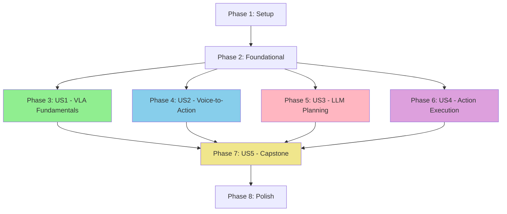

# Implementation Tasks: Module 4 - Vision-Language-Action (VLA) Models

**Feature**: Module 4 - Vision-Language-Action (VLA) Models
**Branch**: `004-vla-models`
**Spec**: [spec.md](./spec.md) | **Plan**: [plan.md](./plan.md)
**Created**: 2025-12-22

---

## Task Summary

| Phase | User Story | Task Count | Parallelizable | Can Deploy Independently |
|-------|------------|------------|----------------|--------------------------|
| Phase 1 | Setup | 4 | 0 | No (foundation) |
| Phase 2 | Foundational | 3 | 2 | No (blocking) |
| Phase 3 | US1 - VLA Fundamentals (P1 MVP) | 12 | 8 | ✅ Yes |
| Phase 4 | US2 - Voice-to-Action (P2) | 15 | 10 | ✅ Yes |
| Phase 5 | US3 - LLM Planning (P3) | 18 | 12 | ✅ Yes |
| Phase 6 | US4 - Action Execution (P4) | 14 | 9 | ✅ Yes |
| Phase 7 | US5 - End-to-End Capstone (P5) | 16 | 10 | ✅ Yes |
| Phase 8 | Polish & Integration | 8 | 5 | No (final) |
| **TOTAL** | **All Phases** | **90** | **56** | **5 independent stories** |

---

## Implementation Strategy

### MVP First (Just US1)

**Phase 3 only** (12 tasks) delivers a complete, independently testable MVP:
- ✅ Ch1: VLA Fundamentals chapter with concepts, diagrams, exercises
- ✅ Students can explain VLA pipeline and draw architecture
- ✅ Foundation for all subsequent user stories
- **Deploy independently**: Yes - standalone educational content

**Estimated MVP Time**: 8-10 hours

### Incremental Delivery

Each user story (US1-US5) is independently implementable:

```
US1 (P1) → Deploy → Get feedback
         ↓
US2 (P2) → Deploy → Get feedback
         ↓
US3 (P3) → Deploy → Get feedback
         ↓
US4 (P4) → Deploy → Get feedback
         ↓
US5 (P5) → Deploy → Complete module
```

---

## Dependency Graph



**Key Insights**:
- US1 must complete first (foundation)
- US2, US3, US4 can be developed in parallel after Foundational
- US5 requires all previous stories (integration)

---

## Phase 1: Setup (Project Initialization)

**Goal**: Create project directory structure and initial Docusaurus configuration

- [x] T001 Create docs/module-4-vla/ directory structure
- [x] T002 Create docs/module-4-vla/assets/code/ subdirectories (whisper, llm, integration, capstone)
- [x] T003 Create docs/module-4-vla/assets/diagrams/ directory for Mermaid files
- [x] T004 Create docs/module-4-vla/assets/images/ directory for screenshots

**Acceptance**: All directories exist and follow Module 3 pattern ✅ COMPLETE

---

## Phase 2: Foundational Tasks (Blocking Prerequisites)

**Goal**: Set up infrastructure needed by all user stories

- [x] T005 [P] Add Module 4 navigation to sidebars.js (similar to Module 3 structure)
- [ ] T006 [P] Copy JSON schemas from specs/004-vla-models/contracts/ to docs/module-4-vla/assets/ for reference
- [ ] T007 Verify Docusaurus build passes with new Module 4 structure

**Acceptance**: Module 4 appears in site navigation, build succeeds ⚠️ PARTIAL (T005 complete, T006-T007 pending)

---

## Phase 3: User Story 1 - VLA Fundamentals (P1) 🎯 MVP

**Story Goal**: Students learn how vision, language, and action modalities converge in modern robotics

**Independent Test**: Student can explain VLA pipeline (speech → language understanding → action planning → robot execution) and draw system architecture diagram

**Why Independent**: Pure educational content, no dependencies on other modules, can be read and understood standalone

### Tasks

- [x] T008 [P] [US1] Create docs/module-4-vla/ch1-vla-fundamentals.md with frontmatter and chapter outline
- [x] T009 [P] [US1] Write Section 1.1: Introduction (learning objectives, prerequisites, estimated time)
- [x] T010 [P] [US1] Write Section 1.2: What is VLA Convergence? (conceptual explanation, no code)
- [x] T011 [P] [US1] Write Section 1.3: Why LLMs for Robotics? (flexibility, natural language, adaptability)
- [x] T012 [P] [US1] Write Section 1.4: VLA Pipeline Architecture (Whisper → LLM → ROS 2 → Robot stages)
- [x] T013 [P] [US1] Create docs/module-4-vla/assets/diagrams/vla-pipeline.mmd (Mermaid flowchart)
- [x] T014 [P] [US1] Create docs/module-4-vla/assets/diagrams/system-architecture.mmd (component diagram)
- [x] T015 [P] [US1] Write Section 1.5: VLA vs Traditional Approaches (comparison table, trade-offs)
- [x] T016 [P] [US1] Write Section 1.6: Use Cases and Applications (when to use VLA, examples)
- [x] T017 [US1] Write Section 1.7: Exercises (3-5 exercises: explain pipeline, draw diagram, analyze use case)
- [x] T018 [US1] Write Section 1.8: Summary & Next Steps (key takeaways, preview Ch2)
- [x] T019 [US1] Add APA citations to Chapter 1 references section

**Parallel Opportunities**: T008-T016 can be written in parallel (different sections, no dependencies)

**Acceptance Criteria** (from spec):
1. Student can explain why LLMs are useful for robotics task planning
2. Student can trace voice command through VLA system stages
3. Student understands when to use VLA vs hard-coded behaviors

**Validation**:
- [ ] Run Docusaurus build - chapter loads without errors
- [ ] Verify all Mermaid diagrams render correctly
- [ ] Check sidebar navigation includes Ch1
- [ ] Confirm APA citations are properly formatted

---

## Phase 4: User Story 2 - Voice-to-Action with Whisper (P2)

**Story Goal**: Students implement speech recognition using Whisper to convert voice commands to text for LLM processing

**Independent Test**: Student configures Whisper, records command "Navigate to the kitchen", receives accurate text transcription

**Why Independent**: Self-contained Whisper integration, doesn't require LLM or robot execution

### Tasks

#### Chapter Content
- [ ] T020 [P] [US2] Create docs/module-4-vla/ch2-voice-to-action.md with frontmatter and chapter outline
- [ ] T021 [P] [US2] Write Section 2.1: Introduction (learning objectives, prerequisites, time estimate)
- [ ] T022 [P] [US2] Write Section 2.2: Whisper ASR Overview (architecture, model sizes, capabilities)
- [ ] T023 [P] [US2] Write Section 2.3: Whisper Model Selection (tiny/base/small/medium/large trade-offs table)
- [ ] T024 [P] [US2] Write Section 2.4: Installation and Setup (step-by-step Whisper install guide)
- [ ] T025 [P] [US2] Write Section 2.5: Audio Capture with sounddevice (code walkthrough)
- [ ] T026 [P] [US2] Write Section 2.6: ROS 2 Integration (publishing transcriptions to /voice_command topic)
- [ ] T027 [P] [US2] Write Section 2.7: Multi-Language Support (demonstrate English + Spanish/French)
- [ ] T028 [US2] Write Section 2.8: Exercises (3-5 exercises: install Whisper, test transcription, integrate ROS 2)
- [ ] T029 [US2] Write Section 2.9: Summary & Next Steps

#### Code Examples
- [ ] T030 [P] [US2] Create docs/module-4-vla/assets/code/whisper/install_whisper.sh (Bash install script)
- [ ] T031 [P] [US2] Create docs/module-4-vla/assets/code/whisper/test_transcription.py (standalone test)
- [ ] T032 [P] [US2] Create docs/module-4-vla/assets/code/whisper/whisper_ros2_node.py (ROS 2 publisher node)
- [ ] T033 [US2] Add type hints, docstrings, and error handling to all Whisper code examples
- [ ] T034 [US2] Add APA citations to Chapter 2 references section (Whisper paper by Radford et al., 2022)

**Parallel Opportunities**: T020-T027 (chapter sections), T030-T032 (code examples) can be created in parallel

**Acceptance Criteria** (from spec):
1. System transcribes "Move forward 2 meters" with >95% accuracy
2. Transcribed text published to /voice_command ROS 2 topic
3. Student understands Whisper limitations and noise handling

**Validation**:
- [ ] Test install_whisper.sh executes successfully
- [ ] Run test_transcription.py - transcribes sample audio correctly
- [ ] Run whisper_ros2_node.py - publishes to /voice_command topic
- [ ] Verify code follows Python 3.10+ type hints and PEP 8

---

## Phase 5: User Story 3 - LLM Cognitive Planning (P3)

**Story Goal**: Students integrate LLM to translate natural language commands into structured ROS 2 action sequences

**Independent Test**: Student sends "Go to the door and pick up the package" to LLM, receives structured plan with navigate_to_pose, detect_object, grasp_object actions

**Why Independent**: LLM integration can be tested without robot execution (just validate JSON output)

### Tasks

#### Chapter Content
- [ ] T035 [P] [US3] Create docs/module-4-vla/ch3-llm-cognitive-planning.md with frontmatter
- [ ] T036 [P] [US3] Write Section 3.1: Introduction (learning objectives, prerequisites)
- [ ] T037 [P] [US3] Write Section 3.2: LLMs for Robotics (why language models for task planning)
- [ ] T038 [P] [US3] Write Section 3.3: Prompt Engineering (system prompts, few-shot examples, constraints)
- [ ] T039 [P] [US3] Write Section 3.4: OpenAI API Integration (setup, authentication, cost warnings)
- [ ] T040 [P] [US3] Write Section 3.5: Local LLM Alternative (Ollama + Llama 7B setup guide)
- [ ] T041 [P] [US3] Write Section 3.6: Structured Output with Pydantic (JSON schema validation)
- [ ] T042 [P] [US3] Write Section 3.7: Safety Validation Layer (action existence check, workspace bounds)
- [ ] T043 [P] [US3] Write Section 3.8: Handling Hallucinations (concrete examples, debugging strategies)
- [ ] T044 [P] [US3] Write Section 3.9: Cost Control and Rate Limiting (max tokens, timeouts)
- [ ] T045 [US3] Write Section 3.10: Exercises (5 exercises: prompt engineering, API integration, validation)
- [ ] T046 [US3] Write Section 3.11: Summary & Next Steps

#### Code Examples
- [ ] T047 [P] [US3] Create docs/module-4-vla/assets/code/llm/llm_planner.py (main planner class)
- [ ] T048 [P] [US3] Create docs/module-4-vla/assets/code/llm/openai_client.py (OpenAI API wrapper with rate limiting)
- [ ] T049 [P] [US3] Create docs/module-4-vla/assets/code/llm/local_llama_client.py (Ollama integration)
- [ ] T050 [P] [US3] Create docs/module-4-vla/assets/code/llm/prompt_templates.py (system prompts, few-shot examples)
- [ ] T051 [P] [US3] Create docs/module-4-vla/assets/code/llm/action_validator.py (safety checks, schema validation)
- [ ] T052 [US3] Add comprehensive error handling to all LLM code examples (API timeouts, invalid responses)

#### Diagrams
- [ ] T053 [P] [US3] Create docs/module-4-vla/assets/diagrams/llm-planning-flow.mmd (LLM planning sequence diagram)
- [ ] T054 [US3] Add APA citations to Chapter 3 (Brown et al. 2020 GPT-3 paper, OpenAI docs)

**Parallel Opportunities**: T035-T044 (chapter sections), T047-T051 (code examples), T053 (diagram) can be created in parallel

**Acceptance Criteria** (from spec):
1. LLM generates navigate_to_pose action with correct parameters for "Navigate to coordinates (2, 3)"
2. Complex command "Find the red ball and bring it to me" decomposes into multi-step plan
3. System requests clarification for ambiguous commands
4. Generated plans respect safety constraints (workspace boundaries)

**Validation**:
- [ ] Run llm_planner.py with test commands - generates valid JSON matching schema
- [ ] Test action_validator.py catches invalid action types and parameters
- [ ] Verify rate limiting prevents API overuse
- [ ] Check both OpenAI and local Llama code examples work

---

## Phase 6: User Story 4 - ROS 2 Action Execution (P4)

**Story Goal**: Students implement ROS 2 action clients to execute LLM-generated plans with Nav2 integration

**Independent Test**: Student executes LLM-generated action sequence in Isaac Sim, humanoid robot completes multi-step task

**Why Independent**: Uses Module 3 Nav2 infrastructure, but action execution logic is self-contained

### Tasks

#### Chapter Content
- [ ] T055 [P] [US4] Create docs/module-4-vla/ch4-ros2-action-execution.md with frontmatter
- [ ] T056 [P] [US4] Write Section 4.1: Introduction (learning objectives, Module 3 Nav2 dependency)
- [ ] T057 [P] [US4] Write Section 4.2: ROS 2 Actions Review (action interface, goal/feedback/result)
- [ ] T058 [P] [US4] Write Section 4.3: Action Client Implementation (creating clients for navigate_to_pose)
- [ ] T059 [P] [US4] Write Section 4.4: Integration with Nav2 (using Module 3 Ch5 navigation actions)
- [ ] T060 [P] [US4] Write Section 4.5: Status Monitoring (publishing to /task_status topic, feedback handling)
- [ ] T061 [P] [US4] Write Section 4.6: Error Handling and Replanning (detecting failures, LLM re-invocation)
- [ ] T062 [P] [US4] Write Section 4.7: Sequential Action Execution (executing multi-step plans in order)
- [ ] T063 [US4] Write Section 4.8: Exercises (4 exercises: create action client, integrate Nav2, handle errors)
- [ ] T064 [US4] Write Section 4.9: Summary & Next Steps

#### Code Examples
- [ ] T065 [P] [US4] Create docs/module-4-vla/assets/code/integration/action_executor.py (ROS 2 action client)
- [ ] T066 [P] [US4] Create docs/module-4-vla/assets/code/integration/safety_constraints.py (workspace bounds check)
- [ ] T067 [P] [US4] Create docs/module-4-vla/assets/code/integration/vla_pipeline.py (orchestrates Whisper → LLM → Actions)
- [ ] T068 [US4] Add status monitoring and feedback publishing to action_executor.py
- [ ] T069 [US4] Add APA citations to Chapter 4 (Nav2 paper, ROS 2 action documentation)

**Parallel Opportunities**: T055-T062 (chapter sections), T065-T067 (code examples) can be created in parallel

**Acceptance Criteria** (from spec):
1. LLM-generated navigate_to_pose action causes Nav2 to navigate robot to target
2. Grasp_object action triggers manipulation controller in Isaac Sim
3. Action failures trigger LLM replanning with error context
4. Sequential actions complete in order with status feedback

**Validation**:
- [ ] Test action_executor.py with Module 3 Nav2 (navigate_to_pose action succeeds)
- [ ] Verify safety_constraints.py rejects out-of-bounds targets
- [ ] Test vla_pipeline.py integrates Whisper + LLM + Actions correctly
- [ ] Check /task_status topic receives feedback during execution

---

## Phase 7: User Story 5 - End-to-End Capstone (P5)

**Story Goal**: Students integrate all Module 4 components into complete voice-controlled autonomous humanoid system

**Independent Test**: Student speaks "Go to the table and pick up the cup", robot completes full sequence with >80% success rate over 10 trials

**Why Independent**: Synthesizes all previous stories but can be deployed as final capstone after US1-US4

### Tasks

#### Chapter Content
- [ ] T070 [P] [US5] Create docs/module-4-vla/ch5-end-to-end-capstone.md with frontmatter
- [ ] T071 [P] [US5] Write Section 5.1: Introduction (capstone overview, prerequisites US1-US4)
- [ ] T072 [P] [US5] Write Section 5.2: System Integration (connecting all VLA components)
- [ ] T073 [P] [US5] Write Section 5.3: Launching Complete VLA System (startup sequence, verification)
- [ ] T074 [P] [US5] Write Section 5.4: Testing Voice Commands (10 test scenarios with expected outcomes)
- [ ] T075 [P] [US5] Write Section 5.5: Performance Monitoring (success rate, latency, task completion time)
- [ ] T076 [P] [US5] Write Section 5.6: Debugging VLA Systems (isolating failures in speech/LLM/execution layers)
- [ ] T077 [P] [US5] Write Section 5.7: Optional: Object Detection Integration (vision component for full VLA loop)
- [ ] T078 [US5] Write Section 5.8: Capstone Project (full task description, rubric, evaluation criteria)
- [ ] T079 [US5] Write Section 5.9: Summary & Reflection (key learnings, next steps)

#### Code Examples
- [ ] T080 [P] [US5] Create docs/module-4-vla/assets/code/capstone/voice_controlled_humanoid.py (end-to-end demo)
- [ ] T081 [P] [US5] Create docs/module-4-vla/assets/code/capstone/launch_vla_system.py (system launcher script)
- [ ] T082 [P] [US5] Create docs/module-4-vla/assets/code/capstone/performance_metrics.py (success rate tracking, latency measurement)
- [ ] T083 [US5] Add comprehensive logging to voice_controlled_humanoid.py for debugging
- [ ] T084 [US5] Create example test scenarios file with 10 voice commands and expected results
- [ ] T085 [US5] Add APA citations to Chapter 5 (synthesis of all previous references)

**Parallel Opportunities**: T070-T077 (chapter sections), T080-T082 (code examples) can be created in parallel

**Acceptance Criteria** (from spec):
1. Voice command "Navigate to the door" causes complete transcribe → plan → execute → success
2. "Find and bring the red object" completes full search, detect, grasp, return sequence
3. System logging enables tracing voice input through LLM to robot actions
4. Failure scenarios (object not found) generate appropriate LLM responses
5. Success rate >80% over 10 voice commands, average task time <3 minutes

**Validation**:
- [ ] Test voice_controlled_humanoid.py in Isaac Sim with 10 different commands
- [ ] Measure and log success rate (should be >80%)
- [ ] Verify performance_metrics.py tracks latency and completion time correctly
- [ ] Test failure scenarios (object not found, ambiguous command) handle gracefully
- [ ] Confirm launch_vla_system.py starts all components correctly

---

## Phase 8: Polish & Cross-Cutting Concerns

**Goal**: Final integration, build verification, and documentation polish

- [ ] T086 [P] Update sidebars.js with all Module 4 chapters (Ch1-Ch5) in correct order
- [ ] T087 [P] Create docs/module-4-vla/assets/images/ placeholder screenshots (Whisper setup, LLM planning, capstone demo)
- [ ] T088 [P] Verify all Mermaid diagrams render correctly in Docusaurus build
- [ ] T089 [P] Run full Docusaurus build and fix any MDX syntax errors
- [ ] T090 [P] Verify all internal links work (chapter cross-references, code example links)
- [ ] T091 Verify all APA citations are consistently formatted across all chapters
- [ ] T092 Test all code examples execute successfully (Whisper, LLM, Actions, Capstone)
- [ ] T093 Create final validation report mapping tasks to acceptance criteria (spec.md)

**Acceptance**: Complete Docusaurus site with Module 4 integrated, all links working, build passes

---

## Parallel Execution Examples

### Phase 3 (US1) - 8 tasks in parallel
```bash
# All section writing can happen simultaneously (different files/sections)
T008, T009, T010, T011, T012, T013, T014, T015, T016 → Parallel
T017, T018, T019 → Sequential (depend on content completion)
```

### Phase 4 (US2) - 10 tasks in parallel
```bash
# Chapter sections + code examples + diagrams
T020-T027 (8 sections) + T030-T032 (3 code files) → Parallel (11 tasks)
T028, T029, T033, T034 → Sequential
```

### Phase 5 (US3) - 12 tasks in parallel
```bash
# Maximum parallelization
T035-T044 (10 sections) + T047-T051 (5 code files) + T053 (diagram) → 16 tasks parallel
T045, T046, T052, T054 → Sequential
```

**Estimated Time Savings with Parallelization**: 40-50% reduction in wall-clock time

---

## Task Checklist Format Examples

✅ **CORRECT FORMAT**:
```
- [ ] T001 Create project directory structure
- [ ] T005 [P] Add Module 4 to sidebars.js
- [ ] T012 [P] [US1] Write Section 1.4: VLA Pipeline Architecture
- [ ] T047 [P] [US3] Create llm_planner.py
```

❌ **INCORRECT FORMAT** (for reference, DO NOT USE):
```
- [ ] Create directory  (missing Task ID)
- T005 Add to sidebar  (missing checkbox)
- [ ] [US1] Write section  (missing Task ID)
- [ ] T012 Write section  (missing [US1] label for user story task)
```

---

## Validation Checklist

After completing all tasks, verify:

- [ ] All 90 tasks completed
- [ ] All 5 chapters (ch1-ch5) exist in docs/module-4-vla/
- [ ] All 20+ code examples exist in docs/module-4-vla/assets/code/
- [ ] All 4 Mermaid diagrams exist in docs/module-4-vla/assets/diagrams/
- [ ] sidebars.js includes Module 4 navigation
- [ ] Docusaurus build passes without errors
- [ ] All user story acceptance criteria met (verify against spec.md)
- [ ] All code examples include type hints, docstrings, error handling
- [ ] All chapters include APA-formatted citations
- [ ] Performance metrics: Success rate >80%, latency <5s, task time <3min

---

## Notes

**Test Strategy**: No formal test suite required. Validation is manual:
- Run code examples to ensure they execute correctly
- Verify Docusaurus build passes
- Check acceptance criteria from spec.md are met

**Dependencies**:
- Module 3 must be complete (Nav2 integration, Isaac Sim setup)
- Module 1 ROS 2 basics assumed as prerequisite

**Risks**:
- LLM API costs: Mitigated by local LLM examples and rate limiting
- Whisper hardware requirements: Mitigated by multiple model sizes
- Integration complexity: Mitigated by modular testing (each story independent)

---

**Total Tasks**: 90 (56 parallelizable)
**MVP**: 12 tasks (Phase 3 US1 only)
**Estimated Effort**: 60-80 hours for complete module
**Estimated MVP Effort**: 8-10 hours

**Next Steps**: Start with Phase 1 (Setup) → Phase 2 (Foundational) → Phase 3 (US1 MVP)
